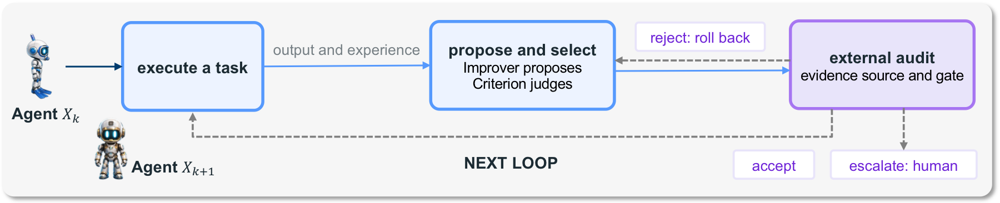
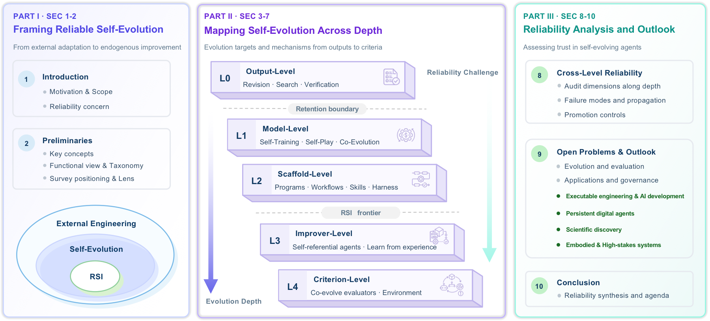
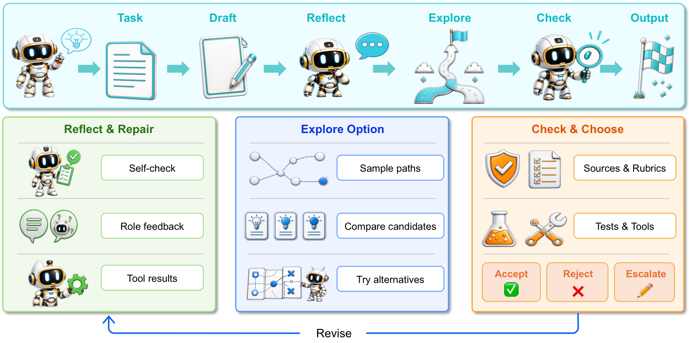
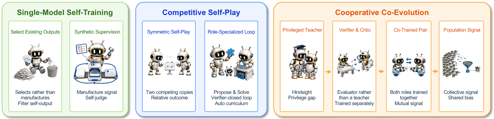
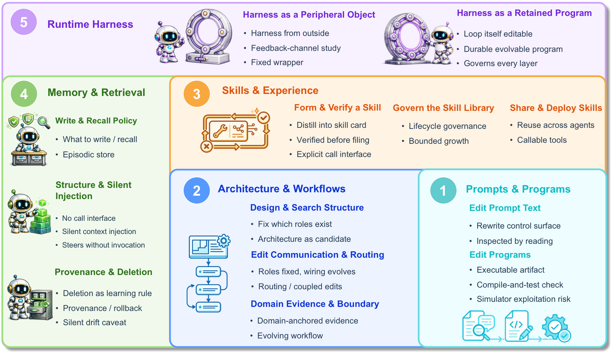
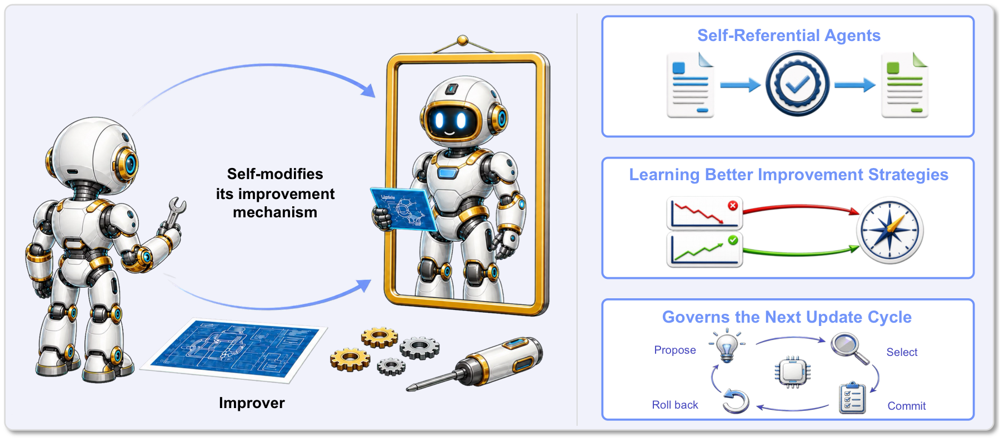
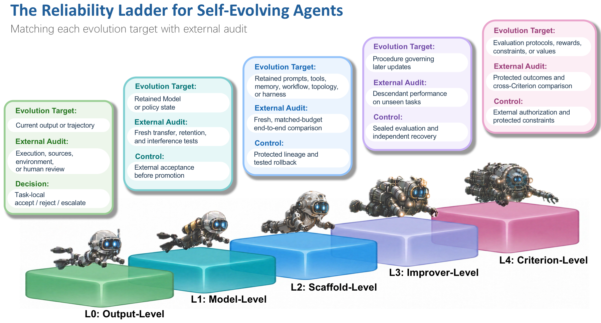
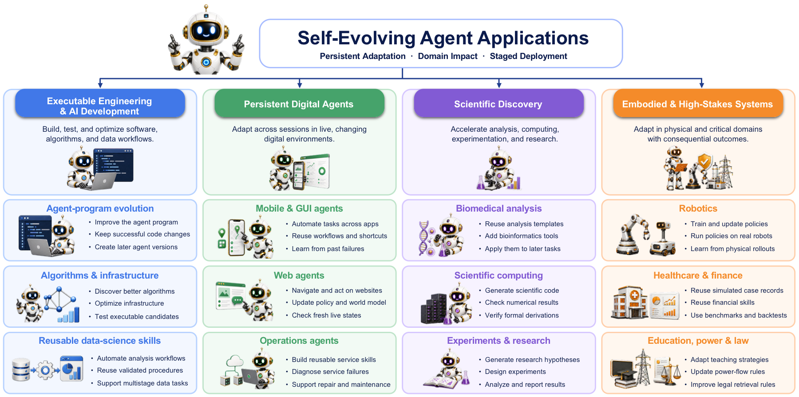

<h1>🧬 Awesome Reliable Self-Evolving Agents</h1>

<strong>A curated collection of research on <em>self-evolving agents</em>, advancing reliable AI self-improvement.</strong> 

  
  
  
  
  
  

  <a href="#why-this-list-is-different">🧭 Taxonomy</a> &nbsp;•&nbsp;
  <a href="#contents">🗂️ Browse</a> &nbsp;•&nbsp;
  <a href="CONTRIBUTING.md">🤝 Contribute</a>

> 🤝 Contributions are welcome: correct a manuscript-used record, or add the paper to the manuscript before proposing it here.

> ✉️ **Contact:** wkqscut@gmail.com, wenjinhou@zju.edu.cn, yanyuchen@zju.edu.cn, hehefan@zju.edu.cn

<picture>
  <source media="(prefers-color-scheme: dark)" srcset="assets/teaser_rounded.png">
  <source media="(prefers-color-scheme: light)" srcset="assets/teaser_rounded.png">
  
</picture>

---

## 🧭 Why This List Is Different <a href="#toc">↑ contents</a>

The catalog follows the survey's two organizing questions: **what changes during self-evolution, and what evidence can support claims of improvement?**

Each transition is classified by the **deepest evolution target whose active semantic change affects a decision-relevant output, update, or judgment**—not by its algorithm name, training stage, or runtime components.

| Level | Deepest active evolution target | Characteristic failure | Works |
| --- | --- | --- | ---: |
|  | Current output or task-local trajectory | Self-confirmation | 42 |
|  | Trainable model or policy state | Model collapse | 137 |
|  | Scaffold | Scaffold overfitting | 257 |
|  | Improver | Metric capture | 21 |
|  | Criterion | Criterion drift | 30 |

L0 is task-local; L1–L4 require a retained change that affects later independent tasks or future updates. The levels describe how far a change reaches, not how capable or reliable the system is.

Under the survey's structural definition, recursive self-improvement (RSI) begins at L3 and extends at L4. This boundary does not itself establish improvement or imply accelerating gains.

Across all levels, reliable self-evolution depends on whether evaluation and oversight remain independent of the update and adequately cover the scope of the improvement claim.

 
<em><b>Figure 1.</b> The self-evolution loop. The agent runs a task, then proposes and selects a candidate change, and an external audit either accepts it, rejects it and rolls back, or escalates to a human. The evidence source and the acceptance gate stay outside the update boundary, so the loop cannot rewrite them.</em>

 
<em><b>Figure 2.</b> What the companion survey covers. Part I frames self-evolution and RSI, Part II maps methods from L0 to L4 by evolution depth, and Part III analyses reliability and open problems.</em>

This repository is the static companion list for the survey. The complete
L0–L4 taxonomy and all 549 manuscript-used papers are presented below.

## 🗂️ Contents

<strong>Browse 549 works by self-evolution level</strong>

- [📚 Surveys and Positioning](#surveys-and-positioning) `24`
- [✍️ L0: Output-Level Self-Evolution](#l0-output-level-self-evolution) `42`
- [🧠 L1: Model-Level Self-Evolution](#l1-model-level-self-evolution) `137`
- [🧰 L2: Scaffold-Level Self-Evolution](#l2-scaffold-level-self-evolution) `257`
- [🔁 L3: Improver-Level Self-Evolution](#l3-improver-level-self-evolution) `21`
- [🎯 L4: Criterion-Level Self-Evolution](#l4-criterion-level-self-evolution) `30`
- [🛡️ Cross-Level Reliability: Evidence, Acceptance, and Control](#cross-level-reliability-evidence-acceptance-and-control) `8`
- [🚀 Open Problems and Outlook](#open-problems-and-outlook) `30`
- [⚖️ License](#license)

## 📚 Surveys and Positioning <a href="#toc">↑ contents</a>

> Surveys and adjacent literature used to position the field; these works are not assigned an L0-L4 self-evolution level.

**↪️ Jump to:** [Field Positioning and Related Surveys (24)](#surveys.positioning)

### Field Positioning and Related Surveys

- **`TMLR 2026`** A Survey of Self-Evolving Agents: What, When, How, and Where to Evolve on the Path to Artificial Super Intelligence. [[paper](https://arxiv.org/abs/2507.21046)] [[companion](https://github.com/CharlesQ9/Self-Evolving-Agents)]
- **`SSRN 2026`** A Systematic Survey of Self-Evolving Agents: From Model-Centric to Environment-Driven Co-Evolution. [[paper](https://doi.org/10.2139/ssrn.6626878)]
- **`arXiv 2026`** Agentic Environment Engineering for LLMs: A Survey of Environment Modeling, Synthesis, Evaluation, and Application. [[paper](https://arxiv.org/abs/2606.12191)]
- **`XYZ Lab 2026`** AI4AI at Scale: A Full-Pipeline System for Enhancing LLM Agentic Capabilities. [[paper](https://xyz-lab.ai/blogs/ai4ai-at-scale/assets/bounded-exploration-ai4ai-system-optimization.pdf)]
- **`arXiv 2026`** Beyond Individual Intelligence: Surveying Collaboration, Failure Attribution, and Self-Evolution in LLM-based Multi-Agent Systems. [[paper](https://arxiv.org/abs/2605.14892)] [[companion](https://github.com/mira-ai-lab/awesome-mas-life)]
- **`Lilian Weng Blog 2026`** Harness Engineering for Self-Improvement. [[paper](https://lilianweng.github.io/posts/2026-07-04-harness)] [[project](https://lilianweng.github.io/posts/2026-07-04-harness)]
- **`arXiv 2026`** Memory for Autonomous LLM Agents: Mechanisms, Evaluation, and Emerging Frontiers. [[paper](https://arxiv.org/abs/2603.07670)]
- **`arXiv 2026`** Self-improvements in modern agentic systems: a survey. [[paper](https://arxiv.org/abs/2607.13104)] [[code](https://github.com/selfimproving-agent/awesome-Self-Improving-Agents)] [[project](https://selfimproving-agent.github.io)]
- **`arXiv 2026`** Self-Improving Agents in the Era of Experience: A Survey of Self- to Meta-Evolution. [[paper](https://openreview.net/forum?id=IUltZSgLMm)]
- **`TMLR 2026`** The Landscape of Agentic Reinforcement Learning for LLMs: A Survey. [[paper](https://arxiv.org/abs/2509.02547)] [[project](https://openreview.net/forum?id=RY19y2RI1O)]
- **`OpenReview 2026`** Towards long-horizon agents: a survey. [[paper](https://openreview.net/forum?id=HyhfhlbWGh)]
- **`Academia AI and Applications 2026`** Towards Trustworthy Agentic AI: A Comprehensive Survey of Safety, Robustness, Privacy, and System Security. [[paper](https://arxiv.org/abs/2605.23989)]
- **`arXiv 2025`** A Comprehensive Survey of Self-Evolving AI Agents: A New Paradigm Bridging Foundation Models and Lifelong Agentic Systems. [[paper](https://arxiv.org/abs/2508.07407)] [[code](https://github.com/EvoAgentX/Awesome-Self-Evolving-Agents)]
- **`arXiv 2025`** A Survey on the Memory Mechanism of Large Language Model based Agents. [[paper](https://arxiv.org/abs/2404.13501)] [[companion](https://github.com/nuster1128/LLM_Agent_Memory_Survey)]
- **`Nature 2025`** Optimizing Generative AI by Backpropagating Language Model Feedback. [[paper](https://www.nature.com/articles/s41586-025-08661-4)]
- **`EMNLP 2025`** Self-Improvement in Multimodal Large Language Models: A Survey. [[paper](https://arxiv.org/abs/2510.02665)]
- **`arXiv 2025`** Towards Lifelong Learning of Large Language Models: A Survey. [[paper](https://arxiv.org/abs/2406.06391)] [[companion](https://github.com/qianlima-lab/awesome-lifelong-learning-methods-for-llm)]
- **`Google DeepMind 2025`** Welcome to the Era of Experience. [[paper](https://storage.googleapis.com/deepmind-media/Era-of-Experience%20/The%20Era%20of%20Experience%20Paper.pdf)]
- **`arXiv 2024`** A Survey on LLM Inference-Time Self-Improvement. [[paper](https://arxiv.org/abs/2412.14352)] [[companion](https://github.com/dongxiangjue/Awesome-LLM-Self-Improvement)]
- **`arXiv 2024`** A Survey on Self-Evolution of Large Language Models. [[paper](https://arxiv.org/abs/2404.14387)] [[companion](https://github.com/AlibabaResearch/DAMO-ConvAI/tree/main/Awesome-Self-Evolution-of-LLM)]
- **`arXiv 2024`** Internal Consistency and Self-Feedback in Large Language Models: A Survey. [[paper](https://arxiv.org/abs/2407.14507)] [[companion](https://github.com/IAAR-Shanghai/ICSFSurvey)]
- **`ICLR 2024`** PromptAgent: Strategic Planning with Language Models Enables Expert-level Prompt Optimization. [[paper](https://openreview.net/forum?id=22pyNMuIoa)]
- **`NeurIPS 2023`** AdaPlanner: Adaptive Planning from Feedback with Language Models. [[paper](https://papers.nips.cc/paper_files/paper/2023/hash/b5c8c1c117618267944b2617add0a766-Abstract-Conference.html)]
- **`NeurIPS 2023`** Reflexion: Language Agents with Verbal Reinforcement Learning. [[paper](https://papers.nips.cc/paper_files/paper/2023/hash/1b44b878bb782e6954cd888628510e90-Abstract-Conference.html)]

---

## ✍️ L0: Output-Level Self-Evolution <a href="#toc">↑ contents</a>

> Deepest active evolution target: **Current output or task-local trajectory**. Characteristic failure: **Self-confirmation**.

 
<em><b>Figure 3.</b> Reflection, exploration, and verification revise the current output while the underlying agent setup stays fixed, so independent tasks start fresh.</em>

**↪️ Jump to:** [Task-Local Boundary and Persistence (1)](#L0.definition) · [Iterative Revision (11)](#L0.iterative_revision) · [Search, Verification, and Acceptance (28)](#L0.search_verification) · [Reliability and the Persistence Limit (2)](#L0.reliability)

### Task-Local Boundary and Persistence

- **`arXiv 2026`** Active Context Compression: Autonomous Memory Management in LLM Agents. [[paper](https://arxiv.org/abs/2601.07190)]

### Iterative Revision

- **`arXiv 2026`** Kestrel: Grounding Self-Refinement for LVLM Hallucination Mitigation. [[paper](https://arxiv.org/abs/2603.16664)]
- **`ECCV 2026`** Reflect-R1: Evidence-Driven Reflection for Self-Correction in Long Video Understanding. [[paper](https://arxiv.org/abs/2606.27922)] [[code](https://github.com/ShuimuChen-hyq/Reflect-R1)]
- **`PACMSE 2025`** Demystifying LLM-Based Software Engineering Agents. [[paper](https://dl.acm.org/doi/10.1145/3715754)]
- **`ACL 2025`** Table-Critic: A Multi-Agent Framework for Collaborative Criticism and Refinement in Table Reasoning. [[paper](https://arxiv.org/abs/2502.11799)] [[code](https://github.com/Peiying-Yu/Table-Critic)]
- **`arXiv 2024`** AgentCoder: Multi-Agent-based Code Generation with Iterative Testing and Optimisation. [[paper](https://arxiv.org/abs/2312.13010)]
- **`arXiv 2024`** Code Generation with AlphaCodium: From Prompt Engineering to Flow Engineering. [[paper](https://arxiv.org/abs/2401.08500)] [[code](https://github.com/Codium-ai/AlphaCodium)]
- **`ICLR 2024`** Teaching Large Language Models to Self-Debug. [[paper](https://arxiv.org/abs/2304.05128)]
- **`ESEC/FSE 2023`** Baldur: Whole-Proof Generation and Repair with Large Language Models. [[paper](https://doi.org/10.1145/3611643.3616243)]
- **`NeurIPS 2023`** Describe, Explain, Plan and Select: Interactive Planning with LLMs Enables Open-World Multi-Task Agents. [[paper](https://papers.nips.cc/paper_files/paper/2023/hash/6b8dfb8c0c12e6fafc6c256cb08a5ca7-Abstract-Conference.html)]
- **`CoRL 2023`** Inner Monologue: Embodied Reasoning through Planning with Language Models. [[paper](https://proceedings.mlr.press/v205/huang23c.html)] [[project](https://innermonologue.github.io)]
- **`NeurIPS 2023`** Self-Refine: Iterative Refinement with Self-Feedback. [[paper](https://papers.nips.cc/paper_files/paper/2023/hash/91edff07232fb1b55a505a9e9f6c0ff3-Abstract-Conference.html)]

### Search, Verification, and Acceptance

- **`arXiv 2026`** CoSPlay: Cooperative Self-Play at Test-Time with Self-Generated Code and Unit Test. [[paper](https://arxiv.org/abs/2605.23491)] [[code](https://github.com/sanae-ai/CosPlay)]
- **`ACL 2026 Findings`** Inference-Time Scaling of Verification: Self-Evolving Deep Research Agents via Test-Time Rubric-Guided Verification (DeepVerifier). [[paper](https://arxiv.org/abs/2601.15808)] [[code](https://github.com/yxwan123/DeepVerifier)]
- **`Nature Communications 2026`** Reasoning in Machine Vision by Learning Fast and Slow Thinking. [[paper](https://arxiv.org/abs/2506.22075)]
- **`ICML 2026`** Reasoning on the Manifold: Bidirectional Consistency for Self-Verification in Diffusion Language Models (BMC). [[paper](https://arxiv.org/abs/2604.16565)]
- **`arXiv 2026`** World-Model-Augmented Web Agents with Action Correction. [[paper](https://arxiv.org/abs/2602.15384)]
- **`arXiv 2025`** CodeMonkeys: Scaling Test-Time Compute for Software Engineering. [[paper](https://arxiv.org/abs/2501.14723)]
- **`ICML 2025`** Forest-of-Thought: Scaling Test-Time Compute for Enhancing LLM Reasoning. [[paper](https://proceedings.mlr.press/v267/bi25a.html)] [[code](https://github.com/iamhankai/Forest-of-Thought)]
- **`TMLR 2025`** Is Your LLM Secretly a World Model of the Internet? Model-Based Planning for Web Agents. [[paper](https://openreview.net/forum?id=c6l7yA0HSq)]
- **`ICLR 2025`** Mutual Reasoning Makes Smaller LLMs Stronger Problem-Solver. [[paper](https://openreview.net/forum?id=6aHUmotXaw)]
- **`EMNLP 2025 Findings`** S*: Test Time Scaling for Code Generation. [[paper](https://aclanthology.org/2025.findings-emnlp.865)] [[code](https://github.com/NovaSky-AI/SkyThought)]
- **`EMNLP 2025`** START: Self-taught Reasoner with Tools. [[paper](https://doi.org/10.18653/v1/2025.emnlp-main.683)]
- **`NeurIPS 2024`** Buffer of Thoughts: Thought-Augmented Reasoning with Large Language Models. [[paper](https://papers.nips.cc/paper_files/paper/2024/hash/cde328b7bf6358f5ebb91fe9c539745e-Abstract-Conference.html)] [[code](https://github.com/YangLing0818/buffer-of-thought-llm)]
- **`ACL 2024 Findings`** Chain-of-Verification Reduces Hallucination in Large Language Models. [[paper](https://aclanthology.org/2024.findings-acl.212)]
- **`ICLR 2024`** CRITIC: LLMs Can Self-Correct with Tool-Interactive Critiquing. [[paper](https://arxiv.org/abs/2305.11738)] [[code](https://github.com/microsoft/ProphetNet/tree/master/CRITIC)]
- **`AAAI 2024`** Graph of Thoughts: Solving Elaborate Problems with Large Language Models. [[paper](https://doi.org/10.1609/aaai.v38i16.29720)]
- **`ICML 2024`** Language Agent Tree Search Unifies Reasoning, Acting, and Planning in Language Models. [[paper](https://proceedings.mlr.press/v235/zhou24r.html)] [[code](https://github.com/lapisrocks/LanguageAgentTreeSearch)]
- **`EMNLP 2024`** Large Language Models Can Self-Correct with Key Condition Verification. [[paper](https://doi.org/10.18653/v1/2024.emnlp-main.714)] [[project](https://wzy6642.github.io/proco.github.io)]
- **`arXiv 2024`** Scaling LLM Test-Time Compute Optimally can be More Effective than Scaling Model Parameters. [[paper](https://arxiv.org/abs/2408.03314)] [[third-party code](https://github.com/huggingface/search-and-learn)]
- **`ICLR 2024`** Solving Challenging Math Word Problems Using GPT-4 Code Interpreter with Code-based Self-Verification. [[paper](https://openreview.net/forum?id=c8McWs4Av0)]
- **`ICLR 2023`** CodeT: Code Generation with Generated Tests. [[paper](https://openreview.net/forum?id=ktrw68Cmu9c)]
- **`EMNLP 2023 Findings`** Large Language Models are Better Reasoners with Self-Verification. [[paper](https://aclanthology.org/2023.findings-emnlp.167)] [[code](https://github.com/WENGSYX/Self-Verification)]
- **`ICML 2023`** LEVER: Learning to Verify Language-to-Code Generation with Execution. [[paper](https://proceedings.mlr.press/v202/ni23b.html)] [[code](https://github.com/niansong1996/lever)]
- **`ACL 2023`** RARR: Researching and Revising What Language Models Say, Using Language Models. [[paper](https://doi.org/10.18653/v1/2023.acl-long.910)]
- **`EMNLP 2023`** Reasoning with Language Model is Planning with World Model. [[paper](https://doi.org/10.18653/v1/2023.emnlp-main.507)]
- **`ICLR 2023`** Self-Consistency Improves Chain of Thought Reasoning in Language Models. [[paper](https://arxiv.org/abs/2203.11171)] [[third-party code](https://github.com/kyegomez/COT-SC)] [[project](https://research.google/pubs/self-consistency-improves-chain-of-thought-reasoning-in-language-models)]
- **`NeurIPS 2023`** Self-Evaluation Guided Beam Search for Reasoning. [[paper](https://papers.nips.cc/paper_files/paper/2023/hash/81fde95c4dc79188a69ce5b24d63010b-Abstract-Conference.html)] [[project](https://guideddecoding.github.io)]
- **`NeurIPS 2023`** Tree of Thoughts: Deliberate Problem Solving with Large Language Models. [[paper](https://arxiv.org/abs/2305.10601)] [[code](https://github.com/princeton-nlp/tree-of-thought-llm)]
- **`EMNLP 2022`** Natural Language to Code Translation with Execution. [[paper](https://doi.org/10.18653/v1/2022.emnlp-main.231)] [[code](https://github.com/facebookresearch/mbr-exec)]

### Reliability and the Persistence Limit

- **`ICLR 2024`** Is Self-Repair a Silver Bullet for Code Generation? [[paper](https://openreview.net/forum?id=y0GJXRungR)]
- **`ICLR 2024`** Large Language Models Cannot Self-Correct Reasoning Yet. [[paper](https://openreview.net/forum?id=IkmD3fKBPQ)]

---

## 🧠 L1: Model-Level Self-Evolution <a href="#toc">↑ contents</a>

> Deepest active evolution target: **Trainable model or policy state**. Characteristic failure: **Model collapse**.

 
<em><b>Figure 4.</b> The three training relations, read left to right as the party emitting the training signal moves further from the trainee and the signal becomes harder to fabricate.</em>

**↪️ Jump to:** [Single-Model Self-Training (51)](#L1.self_training) · [Competitive Self-Play (41)](#L1.self_play) · [Cooperative Co-Evolution (34)](#L1.co_evolution) · [Reliability and the Fixed-Scaffold Limit (11)](#L1.reliability)

### Single-Model Self-Training

- **`ICML 2026 Workshop`** ASH: ASH: Agents that Self-Hone via Embodied Learning. [[paper](https://arxiv.org/abs/2605.14211)]
- **`arXiv 2026`** CoTEvol: COTEVOL: Self-Evolving Chain-of-Thoughts for Data Synthesis in Mathematical Reasoning. [[paper](https://arxiv.org/abs/2604.14768)]
- **`ICML 2026`** CPMobius: CPMöbius: Iterative Coach–Player Reasoning for Data-Free Reinforcement Learning. [[paper](https://arxiv.org/abs/2602.02979)] [[code](https://github.com/thunlp/CPMobius)]
- **`arXiv 2026`** DARE: DARE: Difficulty-Adaptive Reinforcement Learning with Co-Evolved Difficulty Estimation. [[paper](https://arxiv.org/abs/2605.09188)] [[code](https://github.com/EtaYang10th/DARE)]
- **`ACL 2026 Findings`** EasyRL: Easy Samples Are All You Need: Self-Evolving LLMs via Data-Efficient Reinforcement Learning. [[paper](https://arxiv.org/abs/2604.18639)] [[code](https://github.com/YuZhiyin/EasyRL)]
- **`ACL 2026`** EvoCoT: EvoCoT: Overcoming the Exploration Bottleneck in Reinforcement Learning for LLMs. [[paper](https://arxiv.org/abs/2508.07809)] [[code](https://github.com/gtxygyzb/EvoCoT)]
- **`ICLR 2026`** EvoQuality: Self-Evolving Vision-Language Models for Image Quality Assessment via Voting and Ranking. [[paper](https://arxiv.org/abs/2509.25787)] [[code](https://github.com/bytedance/EvoQuality)]
- **`arXiv 2026`** EvoStreaming: EvoStreaming: Your Offline Video Model Is a Natively Streaming Assistant. [[paper](https://arxiv.org/abs/2605.10343)] [[code](https://github.com/BoxueYang/EvoStreaming)]
- **`arXiv 2026`** Geometric Logic Consistency: Self-Evolving Spatial Reasoning in Vision Language Models via Geometric Logic Consistency. [[paper](https://arxiv.org/abs/2605.18162)]
- **`arXiv 2026`** Kairos: A Regret-Aware Native World-Action Model Stack for Physical AI. [[paper](https://arxiv.org/abs/2606.16533)] [[code](https://github.com/kairos-agi/kairos)]
- **`arXiv 2026`** LangRetrieval: Language-Guided Self-Evolving Satellite-to-Radar Retrieval via CSI-Driven Reward. [[paper](https://arxiv.org/abs/2606.09486)]
- **`SIGKDD 2026`** LC-ERD: LC-ERD: Mining Latent Logic for Self-Evolving Reasoning via Consistency-Regulated Reward Decomposition. [[paper](https://arxiv.org/abs/2605.24005)] [[code](https://github.com/LC-ERD-repo/LC-ERD)]
- **`ICML 2026`** Learning to Label: A Reinforced Self-Evolving Framework for Semi-supervised Referring Expression Segmentation. [[paper](https://arxiv.org/abs/2605.28239)]
- **`AAAI 2026`** MedS³: MedS3: Towards Medical Slow Thinking with Self-Evolved Soft Dual-sided Process Supervision. [[paper](https://arxiv.org/abs/2501.12051)] [[code](https://github.com/pixas/medsss)]
- **`arXiv 2026`** MetaClaw: Just Talk — An Agent That Meta-Learns and Evolves in the Wild. [[paper](https://arxiv.org/abs/2603.17187)] [[code](https://github.com/aiming-lab/MetaClaw)]
- **`arXiv 2026`** OASIF: An Efficient Obfuscation-Aware Self-Improving Framework for LLM-Based Assembly Code Instruction Following and Comprehension. [[paper](https://arxiv.org/abs/2606.29155)]
- **`ICML 2026`** One-Way Policy Optimization: One-Way Policy Optimization for Self-Evolving LLMs. [[paper](https://arxiv.org/abs/2605.22156)]
- **`arXiv 2026`** PolicyLong: Towards On-Policy Context Extension. [[paper](https://arxiv.org/abs/2604.07809)]
- **`arXiv 2026`** Rethinking Continual Experience Internalization for Self-Evolving LLM Agents. [[paper](https://arxiv.org/abs/2606.04703)] [[code](https://github.com/RUCBM/ExpInternalization)]
- **`arXiv 2026`** RetroAgent: From Solving to Evolving via Retrospective Dual Intrinsic Feedback. [[paper](https://arxiv.org/abs/2603.08561)] [[code](https://github.com/zhangxy-2019/RetroAgent)]
- **`arXiv 2026`** Rubric-based Self-play: Bootstrapping Post-training Signals for Open-ended Tasks via Rubric-based Self-play on Pre-training Text. [[paper](https://arxiv.org/abs/2604.20051)] [[code](https://github.com/HCY123902/POP)]
- **`arXiv 2026`** SearchGym: Bootstrapping Real-World Search Agents via Cost-Effective and High-Fidelity Environment Simulation. [[paper](https://arxiv.org/abs/2601.14615)] [[code](https://github.com/JIA-Lab-research/SearchGym)]
- **`arXiv 2026`** Seirênes: Seirênes: Adversarial Self-Play with Evolving Distractions for LLM Reasoning. [[paper](https://arxiv.org/abs/2605.11636)] [[code](https://github.com/MiliLab/Seirenes)]
- **`arXiv 2026`** Self-Improving 4D Perception via Self-Distillation (SelfEvo). [[paper](https://arxiv.org/abs/2604.08532)] [[code](https://github.com/Self-Evo/SelfEvo)] [[project](https://self-evo.github.io)]
- **`arXiv 2026`** Sentinel-VLA: A Metacognitive VLA Model with Active Status Monitoring for Dynamic Reasoning and Error Recovery. [[paper](https://arxiv.org/abs/2605.01191)]
- **`AAAI 2026`** SERL: SERL: Self-Examining Reinforcement Learning on Open-Domain. [[paper](https://arxiv.org/abs/2511.07922)] [[code](https://github.com/AlwaysOu/SERL)]
- **`arXiv 2026`** Socratic-SWE: Socratic-SWE: Self-Evolving Coding Agents via Trace-Derived Agent Skills. [[paper](https://arxiv.org/abs/2606.07412)]
- **`arXiv 2026`** The Era of Real-World Human Interaction: RL from User Conversations. [[paper](https://arxiv.org/abs/2509.25137)]
- **`arXiv 2026`** TTVS: Boosting Self-Exploring Reinforcement Learning via Test-time Variational Synthesis. [[paper](https://arxiv.org/abs/2604.08468)]
- **`arXiv 2026`** UI-Mem: Self-Evolving Experience Memory for Online Reinforcement Learning in Mobile GUI Agents. [[paper](https://arxiv.org/abs/2602.05832)] [[project](https://ui-mem.github.io)]
- **`ICLR 2026 (Oral)`** VC-STaR: Through the Lens of Contrast: Self-Improving Visual Reasoning in VLMs. [[paper](https://arxiv.org/abs/2603.02556)] [[code](https://github.com/zhiyupan42/VC-STaR)]
- **`ECCV 2026`** VISE: Paying More Attention to Visual Tokens in Self-Evolving Large Multimodal Models. [[paper](https://arxiv.org/abs/2606.27373)] [[code](https://github.com/mbzuai-oryx/VISE)] [[project](https://mbzuai-oryx.github.io/VISE)]
- **`arXiv 2026`** World Knowledge Exploration: Training LLM Agents for Spontaneous, Reward-Free Self-Evolution via World Knowledge Exploration. [[paper](https://arxiv.org/abs/2604.18131)] [[code](https://github.com/Bklight999/world-knowledge)]
- **`ICLR 2025`** Aligning Language Models with Demonstrated Feedback. [[paper](https://arxiv.org/abs/2406.00888)] [[code](https://github.com/SALT-NLP/demonstrated-feedback)]
- **`ICML 2025`** Diving into Self-Evolving Training: Diving into Self-Evolving Training for Multimodal Reasoning. [[paper](https://arxiv.org/abs/2412.17451)] [[code](https://github.com/hkust-nlp/mstar)] [[project](https://mstar-lmm.github.io)]
- **`ICLR 2025`** LongPO: LongPO: Long Context Self-Evolution of Large Language Models through Short-to-Long Preference Optimization. [[paper](https://arxiv.org/abs/2502.13922)] [[code](https://github.com/DAMO-NLP-SG/LongPO)]
- **`EMNLP 2025`** Middo: Model-Informed Dynamic Data Optimization for Enhanced LLM Fine-Tuning via Closed-Loop Learning. [[paper](https://arxiv.org/abs/2508.21589)] [[code](https://github.com/Word2VecT/Middo)]
- **`NeurIPS 2025`** MindGYM: MindGYM: What Matters in Question Synthesis for Thinking-Centric Fine-Tuning? [[paper](https://arxiv.org/abs/2503.09499)] [[code](https://github.com/datajuicer/data-juicer/tree/MindGYM)]
- **`arXiv 2025`** Process-based Self-Rewarding Language Models. [[paper](https://arxiv.org/abs/2503.03746)] [[code](https://github.com/shimao-zhang/process-self-rewarding)]
- **`NeurIPS 2025`** Retrospective In-Context Learning for Temporal Credit Assignment with Large Language Models (RICOL). [[paper](https://arxiv.org/abs/2602.17497)]
- **`NeurIPS 2025 Workshop`** RoiRL: RoiRL: Efficient, Self-Supervised Reasoning with Offline Iterative Reinforcement Learning. [[paper](https://arxiv.org/abs/2510.02892)]
- **`CoLM 2025`** SCRIT: Self-Evolving Critique Abilities in Large Language Models. [[paper](https://arxiv.org/abs/2501.05727)]
- **`ICLR 2025`** SER: Self-Evolved Reward Learning for LLMs. [[paper](https://arxiv.org/abs/2411.00418)] [[project](https://microsoft.github.io/DKI_LLM/ser/ser_index.html)]
- **`arXiv 2025`** TTRL: Test-Time Reinforcement Learning. [[paper](https://arxiv.org/abs/2504.16084)] [[code](https://github.com/PRIME-RL/TTRL)]
- **`ICML 2024`** RLAIF vs. RLHF: Scaling Reinforcement Learning from Human Feedback with AI Feedback. [[paper](https://arxiv.org/abs/2309.00267)] [[third-party code](https://github.com/mengdi-li/vanilla-RLAIF-pipeline)]
- **`arXiv 2024`** Self-Rewarding Language Models. [[paper](https://arxiv.org/abs/2401.10020)] [[third-party code](https://github.com/lucidrains/self-rewarding-lm-pytorch)]
- **`EMNLP 2023`** Large Language Models Can Self-Improve. [[paper](https://arxiv.org/abs/2210.11610)]
- **`arXiv 2023`** Reinforced Self-Training (ReST) for Language Modeling. [[paper](https://arxiv.org/abs/2308.08998)] [[third-party code](https://github.com/kyegomez/ReST)]
- **`ACL 2023`** Self-Instruct: Aligning Language Models with Self-Generated Instructions. [[paper](https://arxiv.org/abs/2212.10560)] [[code](https://github.com/yizhongw/self-instruct)]
- **`arXiv 2022`** Constitutional AI: Harmlessness from AI Feedback. [[paper](https://arxiv.org/abs/2212.08073)] [[code](https://github.com/anthropics/ConstitutionalHarmlessnessPaper)] [[project](https://www.anthropic.com/research/constitutional-ai-harmlessness-from-ai-feedback)]
- **`NeurIPS 2022`** STaR: Bootstrapping Reasoning With Reasoning (Self-Taught Reasoner). [[paper](https://arxiv.org/abs/2203.14465)] [[code](https://github.com/ezelikman/STaR)]

### Competitive Self-Play

- **`ICLR 2026 Workshop`** ACE (Coding): ACE: Self-Evolving LLM Coding Framework via Adversarial Unit Test Generation and Preference Optimization. [[paper](https://arxiv.org/abs/2605.16299)]
- **`arXiv 2026`** Ask-Solve-Generate: Self-Evolving Unified Multimodal Understanding and Generation via Self-Consistency Rewards. [[paper](https://arxiv.org/abs/2606.27376)] [[code](https://github.com/mbzuai-oryx/Ask-Solve-Generate)] [[project](https://mbzuai-oryx.github.io/Ask-Solve-Generate)]
- **`ECCV 2026`** C2-Evo（SyncLoop）: SyncLoop: A Multimodal Dual-Loop Framework for Self-Improving Mathematical Reasoning. [[paper](https://arxiv.org/abs/2507.16518)] [[code](https://github.com/chen-xw/C2-Evo)]
- **`ACL 2026`** CoEvolve: CoEvolve: Training LLM Agents via Agent-Data Mutual Evolution. [[paper](https://arxiv.org/abs/2604.15840)]
- **`ACL 2026`** DEPT: Breaking the Impasse: Dual-Scale Evolutionary Policy Training for Social Language Agents. [[paper](https://arxiv.org/abs/2605.08721)]
- **`arXiv 2026`** EvoVid: EvoVid: Temporal-Centric Self-Evolution for Video Large Language Models. [[paper](https://arxiv.org/abs/2605.21931)] [[project](https://huangshiqi128.github.io/EvoVid.io)]
- **`ACL 2026`** FoPO: Foresight Optimization for Strategic Reasoning in Large Language Models. [[paper](https://arxiv.org/abs/2604.13592)] [[code](https://github.com/wangjs9/ForesightOptim)]
- **`arXiv 2026`** G-Zero: G-Zero: Self-Play for Open-Ended Generation from Zero Data. [[paper](https://arxiv.org/abs/2605.09959)] [[code](https://github.com/Chengsong-Huang/G-Zero)]
- **`ICLR 2026 Workshop (Spotlight)`** GASP: GASP: Guided Asymmetric Self-Play for Coding LLMs. [[paper](https://arxiv.org/abs/2603.15957)]
- **`ICLR 2026`** Generative Adversarial Reasoner: Generative Adversarial Reasoner: Enhancing LLM Reasoning with Adversarial Reinforcement Learning. [[paper](https://arxiv.org/abs/2512.16917)]
- **`arXiv 2026`** GeoX: GeoX: Mastering Geospatial Reasoning Through Self-Play and Verifiable Rewards. [[paper](https://arxiv.org/abs/2605.20006)]
- **`ACL 2026 Findings`** iReasoner: IREASONER: Trajectory-Aware Intrinsic Reasoning Supervision for Self-Evolving Large Multimodal Models. [[paper](https://arxiv.org/abs/2601.05877)] [[code](https://github.com/meghanaasunil/iReasoner)] [[project](https://meghanaasunil.github.io/iReasoner)]
- **`arXiv 2026`** IRIS: Interpolative Rényi Iterative Self-play for Large Language Model Fine-Tuning. [[paper](https://arxiv.org/abs/2604.20933)]
- **`arXiv 2026`** KG Paths as Supervision: Knowledge-Graph Paths as Intermediate Supervision for Self-Evolving Search Agents. [[paper](https://arxiv.org/abs/2605.05702)]
- **`ICLR 2026`** R-Zero: Self-Evolving Reasoning LLM from Zero Data. [[paper](https://openreview.net/forum?id=96apU6YzSO)]
- **`arXiv 2026`** RISE: RISE: Reliable Improvement in Self-Evolving Vision-Language Models. [[paper](https://arxiv.org/abs/2605.20914)] [[code](https://github.com/AMAP-ML/RISE)]
- **`ICML 2026`** S-SPPO: S-SPPO: Semantic-Calibrated Self-Play Preference Optimization. [[paper](https://arxiv.org/abs/2606.01561)] [[code](https://github.com/xiwenc1/s-sppo)]
- **`arXiv 2026`** SEIF: SEIF: Self-Evolving Reinforcement Learning for Instruction Following. [[paper](https://arxiv.org/abs/2605.07465)] [[code](https://github.com/Rainier-rq1/SEIF)]
- **`arXiv 2026`** SELF-EMO: Emotional Self-Evolution from Recognition to Consistent Expression. [[paper](https://arxiv.org/abs/2604.18003)]
- **`arXiv 2026`** Self-Evolving Visual Questioner. [[paper](https://arxiv.org/abs/2606.13929)] [[code](https://github.com/tianyi-lab/SeeQ)] [[project](https://joliang17.github.io/SelfEvolvingVQG)]
- **`ICML 2026`** Self-Play Only Evolves When Self-Synthetic Pipeline Ensures Learnable Information Gain. [[paper](https://arxiv.org/abs/2603.02218)]
- **`ICML 2026`** Self-play SWE-RL: Toward Training Superintelligent Software Agents through Self-Play SWE-RL. [[paper](https://arxiv.org/abs/2512.18552)]
- **`arXiv 2026`** SpatialEvo: SpatialEvo: Self-Evolving Spatial Intelligence via Deterministic Geometric Environments. [[paper](https://arxiv.org/abs/2604.14144)] [[code](https://github.com/ZJU-REAL/SpatialEvo)]
- **`ICLR 2026`** SPELL: SPELL: Self-Play Reinforcement Learning for Evolving Long-Context Language Models. [[paper](https://arxiv.org/abs/2509.23863)] [[code](https://github.com/Tongyi-Zhiwen/Qwen-Doc/tree/main/SPELL)]
- **`ICLR 2026`** SPIRAL: SPIRAL: Self-Play on Zero-Sum Games Incentivizes Reasoning via Multi-Agent Multi-Turn Reinforcement Learning. [[paper](https://arxiv.org/abs/2506.24119)] [[code](https://github.com/spiral-rl/spiral)]
- **`arXiv 2026`** Survive or Collapse: Survive or Collapse: The Asymmetric Roles of Data Gating and Reward Grounding in Self-Play RL. [[paper](https://arxiv.org/abs/2605.22217)]
- **`ACL 2026`** TPAW: Team-Based Self-Play With Dual Adaptive Weighting for Fine-Tuning LLMs. [[paper](https://arxiv.org/abs/2605.09922)] [[code](https://github.com/lab-klc/TPAW)]
- **`ICML 2026`** Transitivity Meets Cyclicity: Explicit Preference Decomposition for Dynamic Large Language Model Alignment. [[paper](https://arxiv.org/abs/2605.17342)] [[code](https://github.com/lab-klc/Hybrid-Reward-Cyclic)]
- **`ICML 2026`** TSP（Tree-like Self-Play）: Learn from Your Mistakes: Tree-like Self-Play for Secure Code LLMs. [[paper](https://arxiv.org/abs/2606.03489)] [[code](https://github.com/Easonnoway/TSP)]
- **`ICLR 2026`** Vision-Zero: Vision-Zero: Scalable VLM Self-Evolution via Multi-Agent Self-Play. [[paper](https://arxiv.org/abs/2509.25541)] [[code](https://github.com/wangqinsi1/Vision-Zero)]
- **`CVPR 2026`** VisPlay: Self-Evolving Vision-Language Models. [[paper](https://openaccess.thecvf.com/content/CVPR2026/html/He_VisPlay_Self-Evolving_Vision-Language_Models_CVPR_2026_paper.html)]
- **`arXiv 2026`** Vocabulary Dropout for Curriculum Diversity in LLM Co-Evolution. [[paper](https://arxiv.org/abs/2604.03472)] [[project](https://www.jacobdineen.com/publications/vocab-dropout-2026)]
- **`arXiv 2025`** Absolute Zero: Reinforced Self-play Reasoning with Zero Data. [[paper](https://arxiv.org/abs/2505.03335)] [[code](https://github.com/LeapLabTHU/Absolute-Zero-Reasoner)] [[project](https://andrewzh112.github.io/absolute-zero-reasoner)]
- **`ICML 2025`** CDG: Improving Rationality in the Reasoning Process of Language Models through Self-playing Game. [[paper](https://arxiv.org/abs/2506.22920)]
- **`ICLR 2025`** Magnetic Preference Optimization: Achieving Last-Iterate Convergence for Language Model Alignment. [[paper](https://arxiv.org/abs/2410.16714)]
- **`NeurIPS 2025`** SPACE: SPACE: Noise Contrastive Estimation Stabilizes Self-Play Fine-Tuning for Large Language Models. [[paper](https://arxiv.org/abs/2512.07175)]
- **`EMNLP 2025 Findings`** SPFT-SQL: SPFT-SQL: Enhancing Large Language Model for Text-to-SQL Parsing by Self-Play Fine-Tuning. [[paper](https://arxiv.org/abs/2509.03937)]
- **`NeurIPS 2025`** T-SPIN: Triplets Better Than Pairs: Towards Stable and Effective Self-Play Fine-Tuning for LLMs. [[paper](https://arxiv.org/abs/2601.08198)]
- **`ACL 2025 Findings`** TRANS-ZERO: TRANS-ZERO: Self-Play Incentivizes Large Language Models for Multilingual Translation Without Parallel Data. [[paper](https://arxiv.org/abs/2504.14669)] [[code](https://github.com/NJUNLP/trans0)]
- **`NeurIPS 2024`** Adversarial Taboo Self-Play (SPAG): Self-playing Adversarial Language Game Enhances LLM Reasoning. [[paper](https://arxiv.org/abs/2404.10642)] [[code](https://github.com/Linear95/SPAG)]
- **`ICML 2024`** SPIN: Self-Play Fine-Tuning Converts Weak Language Models to Strong Language Models. [[paper](https://arxiv.org/abs/2401.01335)] [[code](https://github.com/uclaml/SPIN)] [[project](https://uclaml.github.io/SPIN)]

### Cooperative Co-Evolution

- **`arXiv 2026`** ARISE: Agent Reasoning with Intrinsic Skill Evolution in Hierarchical Reinforcement Learning. [[paper](https://arxiv.org/abs/2603.16060)] [[code](https://github.com/Skylanding/ARISE)]
- **`arXiv 2026`** Be My Tutor: On-Policy Co-Distillation for Mutual LLM Improvement via Peer Feedback. [[paper](https://arxiv.org/abs/2606.14368)]
- **`arXiv 2026`** Co-Evolution of Policy and Internal Reward for Language Agents. [[paper](https://arxiv.org/abs/2604.03098)]
- **`arXiv 2026`** Co-Evolving Policy Distillation: Co-Evolving Policy Distillation. [[paper](https://arxiv.org/abs/2604.27083)]
- **`arXiv 2026`** CoHyDE: Iterative Co-Training of LLM Rewriter & Dense Encoder for Tool Retrieval. [[paper](https://arxiv.org/abs/2605.29271)]
- **`arXiv 2026`** COMAP: COMAP: Co-Evolving World Models and Agent Policies for LLM Agents. [[paper](https://arxiv.org/abs/2606.02372)] [[code](https://github.com/loyiv/CoMAP)]
- **`arXiv 2026`** Cross-Model Entropy: Label-Free Reinforcement Learning via Cross-Model Entropy. [[paper](https://arxiv.org/abs/2605.29009)]
- **`arXiv 2026`** DUEL: Adversarial Self-Play for Multimodal Reasoning. [[paper](https://arxiv.org/abs/2605.24794)]
- **`arXiv 2026`** Evolving-RL: Evolving-RL: End-to-End Optimization of Experience-Driven Self-Evolving Capability within Agents. [[paper](https://arxiv.org/abs/2605.10663)] [[code](https://github.com/Fanzy27/Evolving-RL)]
- **`ICML 2026`** From blind spots to gains: Diagnostic-driven iterative training for large multimodal models. [[paper](https://icml.cc/virtual/2026/poster/60731)] [[code](https://github.com/hongruijia/DPE)]
- **`arXiv 2026`** GenEvolve: Self-Evolving Image Generation Agents via Tool-Orchestrated Visual Experience Distillation. [[paper](https://arxiv.org/abs/2605.21605)] [[code](https://github.com/MeiGen-AI/GenEvolve)] [[project](https://ephemeral182.github.io/GenEvolve)]
- **`arXiv 2026`** In-the-Flow Agentic System Optimization for Effective Planning and Tool Use (AgentFlow). [[paper](https://arxiv.org/abs/2510.05592)] [[code](https://github.com/lupantech/AgentFlow)] [[project](https://agentflow.stanford.edu)]
- **`arXiv 2026`** Interactive Critique-Revision Training for Reliable Structured LLM Generation. [[paper](https://arxiv.org/abs/2605.08327)]
- **`LREC 2026 Workshop`** Learning to Negotiate: Multi-Agent Deliberation for Collective Value Alignment in LLMs. [[paper](https://arxiv.org/abs/2603.10476)]
- **`ACL 2026`** MAESTRO: Meta-learning Adaptive Estimation of Scalarization Trade-offs for Reward Optimization. [[paper](https://arxiv.org/abs/2601.07208)] [[code](https://github.com/zy125413/MAESTRO)]
- **`arXiv 2026`** Measure Twice, Click Once: Measure Twice, Click Once: Co-evolving Proposer and Visual Critic via Reinforcement Learning for GUI Grounding. [[paper](https://arxiv.org/abs/2604.21268)]
- **`arXiv 2026`** OPD-Evolver: Cultivating Holistic Agent Evolver via On-Policy Distillation. [[paper](https://arxiv.org/abs/2606.17628)] [[code](https://github.com/bingreeky/opd-evolver)]
- **`arXiv 2026`** PopuLoRA: PopuLoRA: Co-Evolving LLM Populations for Reasoning Self-Play. [[paper](https://arxiv.org/abs/2605.16727)]
- **`arXiv 2026`** Programming with Data: Test-Driven Data Engineering for Self-Improving LLMs from Raw Corpora. [[paper](https://arxiv.org/abs/2604.24819)] [[code](https://github.com/OpenRaiser/ProDa)]
- **`arXiv 2026`** SEAgent: Self-Evolving Computer Use Agent with Autonomous Learning from Experience. [[paper](https://arxiv.org/abs/2508.04700)] [[code](https://github.com/SunzeY/SEAgent)]
- **`arXiv 2026`** Self-Distilled RL: Self-Distilled Reinforcement Learning for Co-Evolving Agentic Recommender Systems. [[paper](https://arxiv.org/abs/2604.10029)]
- **`ICML 2026`** Self-evolving LLM Agents with In-distribution Optimization (Q-Evolve). [[paper](https://arxiv.org/abs/2606.07367)] [[project](https://qevolve.github.io)]
- **`ICLR 2026 (Poster)`** Self-Harmony: Learning to Harmonize Self-Supervision and Self-Play in Test-Time Reinforcement Learning. [[paper](https://arxiv.org/abs/2511.01191)] [[code](https://github.com/physicsru/self_harmony)]
- **`ACL 2026 Findings`** SERM: SERM: Self-Evolving Relevance Model with Agent-Driven Learning from Massive Query Streams. [[paper](https://arxiv.org/abs/2601.09515)]
- **`arXiv 2026`** Variational Policy Distillation: Learning from Language Feedback via Variational Policy Distillation. [[paper](https://arxiv.org/abs/2605.15113)]
- **`arXiv 2026`** ZeroCoder: Can LLMs Improve Code Generation Without Ground-Truth Supervision? [[paper](https://arxiv.org/abs/2604.07864)]
- **`arXiv 2026`** π-Play: Multi-Agent Self-Play via Privileged Self-Distillation without External Data. [[paper](https://arxiv.org/abs/2604.14054)] [[code](https://github.com/zhyaoch/pi-play)]
- **`CoLM 2025`** Collaborative self-play（元知识）: Don't lie to your friends: Learning what you know from collaborative self-play. [[paper](https://arxiv.org/abs/2503.14481)]
- **`NeurIPS 2025 (Spotlight)`** CURE: Co-Evolving LLM Coder and Unit Tester via Reinforcement Learning. [[paper](https://arxiv.org/abs/2506.03136)] [[code](https://github.com/Gen-Verse/CURE)]
- **`NeurIPS 2025`** QiMeng-MuPa: QiMeng-MuPa: Mutual-Supervised Learning for Sequential-to-Parallel Code Translation. [[paper](https://arxiv.org/abs/2506.11153)] [[code](https://github.com/kcxain/mupa)]
- **`NeurIPS 2025`** RL Tango: RL Tango: Reinforcing Generator and Verifier Together for Language Reasoning. [[paper](https://arxiv.org/abs/2505.15034)] [[code](https://github.com/kaiwenzha/rl-tango)]
- **`EMNLP 2025`** WebEvolver: Enhancing Web Agent Self-Improvement with Co-evolving World Model. [[paper](https://arxiv.org/abs/2504.21024)] [[code](https://github.com/Tencent/SelfEvolvingAgent)]
- **`ICLR 2025`** WebRL: Training LLM Web Agents via Self-Evolving Online Curriculum Reinforcement Learning. [[paper](https://arxiv.org/abs/2411.02337)] [[code](https://github.com/THUDM/WebRL)]
- **`NeurIPS 2024`** CORY: Coevolving with the Other You: Fine-Tuning LLM with Sequential Cooperative Multi-Agent Reinforcement Learning. [[paper](https://arxiv.org/abs/2410.06101)] [[code](https://github.com/Harry67Hu/CORY)]

### Reliability and the Fixed-Scaffold Limit

- **`arXiv 2026`** Autonomous Drift Learning: Autonomous Drift Learning in Data Streams: A Unified Perspective. [[paper](https://arxiv.org/abs/2605.01295)]
- **`arXiv 2026`** Confidence-Orchestrated Self-Evolution: Confidence-Orchestrated Self-Evolution against Uncertain LLM Feedback. [[paper](https://arxiv.org/abs/2605.28010)] [[code](https://anonymous.4open.science/r/COSE_-B5C2)]
- **`arXiv 2026`** Do Self-Evolving Agents Forget?: Do Self-Evolving Agents Forget? Capability Degradation and Preservation in Lifelong LLM Agent Adaptation. [[paper](https://arxiv.org/abs/2605.09315)]
- **`arXiv 2026`** First-Order Recoverability Collapse: First-Order Recoverability Collapse in Self-Referential Information Decoders. [[paper](https://arxiv.org/abs/2606.24861)]
- **`arXiv 2026`** Implicit Conflict Monitoring: Modeling Implicit Conflict Monitoring Mechanisms Against Stereotypes in LLMs. [[paper](https://arxiv.org/abs/2605.09647)]
- **`arXiv 2026`** Matrix-Level Dynamics: When Self-Reference Fails to Close: Matrix-Level Dynamics in Large Language Models. [[paper](https://arxiv.org/abs/2604.12128)]
- **`ICML 2026`** On the Generalization Gap in Self-Evolving Language Model Reasoning. [[paper](https://arxiv.org/abs/2606.01075)]
- **`NAACL 2025`** GSI: Mitigating Tail Narrowing in LLM Self-Improvement via Socratic-Guided Sampling. [[paper](https://arxiv.org/abs/2411.00750)] [[code](https://github.com/Yiwen-Ding/Guided-Self-Improvement)]
- **`NeurIPS 2025`** Is PRM Necessary?: Is PRM Necessary? Problem-Solving RL Implicitly Induces PRM Capability in LLMs. [[paper](https://arxiv.org/abs/2505.11227)]
- **`EMNLP 2025`** Superficial Self-Improved Reasoners: Superficial Self-Improved Reasoners Benefit from Model Merging. [[paper](https://arxiv.org/abs/2503.02103)]
- **`ICML 2024`** A Tale of Tails: A Tale of Tails: Model Collapse as a Change of Scaling Laws. [[paper](https://arxiv.org/abs/2402.07043)]

---

## 🧰 L2: Scaffold-Level Self-Evolution <a href="#toc">↑ contents</a>

> Deepest active evolution target: **Scaffold**. Characteristic failure: **Scaffold overfitting**.

 
<em><b>Figure 5.</b> The widening scaffold scope, from a single prompt or code artifact out to the runtime harness that encloses them all. Each wider region presupposes the narrower objects it organizes, while the improver and criterion stay fixed.</em>

**↪️ Jump to:** [Definition and the Scaffold Boundary (4)](#L2.definition) · [Prompts and Programs (17)](#L2.prompts_programs) · [Architecture and Workflows (77)](#L2.architecture_workflows) · [Skills and Experience (106)](#L2.skills_experience) · [Memory and Retrieval (31)](#L2.memory_retrieval) · [Runtime Harness (14)](#L2.runtime_harness) · [Reliability and the Fixed-Improver Limit (8)](#L2.reliability)

### Definition and the Scaffold Boundary

- **`arXiv 2026`** Darwin Mobile Agent: Darwin Mobile Agent: A Roadmap for Self-Evolution. [[paper](https://arxiv.org/abs/2606.20622)]
- **`arXiv 2026`** From Chatbot to Digital Colleague: From Chatbot to Digital Colleague: The Paradigm Shift Toward Persistent Autonomous AI. [[paper](https://arxiv.org/abs/2606.14502)] [[project](https://from-chatbot-to-digital-colleague.github.io)]
- **`arXiv 2026`** Next-Gen Agentic RL Systems: Next-Generation Agentic Reinforcement Learning Systems Enable Self-Evolving Agents. [[paper](https://arxiv.org/abs/2607.01120)] [[code](https://github.com/areal-project/AReaL)]
- **`arXiv 2026`** Root Theorem of Context Engineering: The Root Theorem of Context Engineering: Formal Derivation, Architectural Prediction, and Engineering Proof. [[paper](https://arxiv.org/abs/2604.20874)]

### Prompts and Programs

- **`ICASSP 2026`** AutoVQA-G: AutoVQA-G: Self-Improving Agentic Framework for Automated Visual Question Answering and Grounding Annotation. [[paper](https://arxiv.org/abs/2604.17488)] [[code](https://github.com/rohnson1999/AutoVQA-G)]
- **`arXiv 2026`** Bi-Component AHD: LLM-Driven Co-Evolutionary Automated Heuristic Design for Bi-Component Coupled Combinatorial Optimization. [[paper](https://arxiv.org/abs/2606.00718)]
- **`arXiv 2026`** Combee: Combee: Scaling Prompt Learning for Self-Improving Language Model Agents. [[paper](https://arxiv.org/abs/2604.04247)] [[code](https://github.com/gepa-ai/gepa)]
- **`arXiv 2026`** DataEvolver: Automatic Data Preparation for Large Language Models through Multi-Level Self-Evolving. [[paper](https://arxiv.org/abs/2606.07001)] [[code](https://github.com/ruc-datalab/DataEvolver)]
- **`ICML 2026 Workshop`** Dense Feedback for Social Dilemmas: Beyond Scalar Rewards: Dense Feedback for LLM Policy Synthesis in Sequential Social Dilemmas. [[paper](https://arxiv.org/abs/2603.19453)] [[code](https://github.com/vicgalle/llm-policies-social-dilemmas)]
- **`arXiv 2026`** EEVEE: Eevee: Towards Test-time Prompt Learning in the Real World for Self-Improving Agents. [[paper](https://arxiv.org/abs/2606.11182)] [[code](https://github.com/Princeton-AI2-Lab/EEVEE)] [[project](https://princeton-ai2-lab.github.io/EEVEE)]
- **`arXiv 2026`** Fluid Control Discovery: Self-Evolving Scientific Agent Discovers Generalizable Physically-Reasoned Fluid Control. [[paper](https://arxiv.org/abs/2606.08405)]
- **`arXiv 2026`** GenTI: Benchmarking LLMs for Autonomous IDPS Rule Generation for Unseen Attacks. [[paper](https://arxiv.org/abs/2606.05844)]
- **`CVPR 2026`** HIER: Evolutionary Multimodal Reasoning via Hierarchical Semantic Representation for Intent Recognition. [[paper](https://arxiv.org/abs/2603.03827)] [[code](https://github.com/thuiar/HIER)]
- **`arXiv 2026`** InferenceEvolve: InferenceEvolve: Automated Causal Effect Estimators through Self-Evolving AI. [[paper](https://arxiv.org/abs/2604.04274)] [[code](https://github.com/yiqunchen/causal-agent)] [[project](https://yiqunchen.github.io/causal-agent)]
- **`arXiv 2026`** MCE (Meta Context Engineering): Meta Context Engineering via Agentic Skill Evolution. [[paper](https://arxiv.org/abs/2601.21557)] [[code](https://github.com/metaevo-ai/meta-context-engineering)]
- **`arXiv 2026`** MLEvolve: MLEvolve: A Self-Evolving Framework for Automated Machine Learning Algorithm Discovery. [[paper](https://arxiv.org/abs/2606.06473)] [[code](https://github.com/InternScience/MLEvolve)]
- **`DAC 2026`** Multi-Agent Self-Evolved ABC: Autonomous Evolution of EDA Tools: Multi-Agent Self-Evolved ABC. [[paper](https://arxiv.org/abs/2604.15082)]
- **`ECIR Workshop 2026 Workshop`** Self-Optimizing MAS for Deep Research: Self-Optimizing Multi-Agent Systems for Deep Research. [[paper](https://arxiv.org/abs/2604.02988)]
- **`SEAMS 2026`** SelfEvolve: Software Self-Extension with SelfEvolve: an Agentic Architecture for Runtime Code Generation. [[paper](https://arxiv.org/abs/2604.16314)]
- **`arXiv 2026`** SHARP: SHARP: A Self-Evolving Human-Auditable Rubric Policy for Financial Trading Agents. [[paper](https://arxiv.org/abs/2605.06822)]
- **`ICML 2025 Workshop`** Game-Playing via Generative Code Optimization: Learning Game-Playing Agents with Generative Code Optimization. [[paper](https://arxiv.org/abs/2508.19506)] [[code](https://github.com/ameliakuang/LLM-Game-Playing-Agents)]

### Architecture and Workflows

- **`arXiv 2026`** A Self-Evolving Agentic Framework for Metasurface Inverse Design. [[paper](https://arxiv.org/abs/2604.01480)]
- **`arXiv 2026`** A Self-Evolving Agentic System for Automated Generation and Execution of Biological Protocols (ProtoPilot). [[paper](https://arxiv.org/abs/2606.31763)]
- **`arXiv 2026`** ABot-Claw: A Foundation for Persistent, Cooperative, and Self-Evolving Robotic Agents. [[paper](https://arxiv.org/abs/2604.10096)]
- **`arXiv 2026`** Agent libOS: A Runtime Substrate for Capability-Controlled Self-Evolving LLM Agents. [[paper](https://arxiv.org/abs/2606.03895)] [[code](https://github.com/yingqi-z20/Agent-libOS)]
- **`arXiv 2026`** AgentFactory: A Self-Evolving Framework Through Executable Subagent Accumulation and Reuse. [[paper](https://arxiv.org/abs/2603.18000)] [[code](https://github.com/zzatpku/AgentFactory)]
- **`arXiv 2026`** Agentic Hardware Design as Repository-Level Code Evolution (HORIZON). [[paper](https://arxiv.org/abs/2606.28279)]
- **`arXiv 2026`** Agentic Harness Engineering: Observability-Driven Automatic Evolution of Coding-Agent Harnesses. [[paper](https://arxiv.org/abs/2604.25850)] [[code](https://github.com/china-qijizhifeng/agentic-harness-engineering)]
- **`arXiv 2026`** AgentX: Towards Agent-Driven Self-Iteration of Industrial Recommender Systems. [[paper](https://arxiv.org/abs/2606.26859)]
- **`arXiv 2026`** AgRefactor: Self-Evolving Agentic Workflow for HLS Compatibility and Performance. [[paper](https://arxiv.org/abs/2606.30949)]
- **`arXiv 2026`** AIRA-Compose / AIRA-Design: Agentic Discovery of Neural Architectures: AIRA-Compose and AIRA-Design. [[paper](https://arxiv.org/abs/2605.15871)]
- **`arXiv 2026`** ArtiCAD: Articulated CAD Assembly Design via Multi-Agent Code Generation. [[paper](https://arxiv.org/abs/2604.10992)]
- **`arXiv 2026`** Autogenesis: A Self-Evolving Agent Protocol. [[paper](https://arxiv.org/abs/2604.15034)] [[code](https://github.com/DVampire/Autogenesis)]
- **`arXiv 2026`** Autopoiesis: A Self-Evolving System Paradigm for LLM Serving Under Runtime Dynamics. [[paper](https://arxiv.org/abs/2604.07144)]
- **`arXiv 2026`** Bian Que: An Agentic Framework with Flexible Skill Arrangement for Online System Operations. [[paper](https://arxiv.org/abs/2604.26805)] [[code](https://github.com/benchen4395/BianQue_Assistant)] [[project](https://benchen4395.github.io)]
- **`arXiv 2026`** BloClaw: An Omniscient, Multi-Modal Agentic Workspace for Next-Generation Scientific Discovery. [[paper](https://arxiv.org/abs/2604.00550)] [[code](https://github.com/qinheming/BIoClaw)]
- **`arXiv 2026`** Catalyst Discovery: Autonomous Heterogeneous Catalyst Discovery with a Self-Evolving Multi-Agent Digital Twin. [[paper](https://arxiv.org/abs/2606.05050)]
- **`arXiv 2026`** Co-evolving Agent Architectures and Interpretable Reasoning for Automated Optimization. [[paper](https://arxiv.org/abs/2604.17708)]
- **`arXiv 2026`** Compute Allocation in Evo Search: Compute Allocation in Evolutionary Search: From Depth–Breadth to Multi-Armed Bandits. [[paper](https://arxiv.org/abs/2605.29268)] [[code](https://github.com/keruiwu/self-evolving-allocation)]
- **`arXiv 2026`** CyberEvolver: Structured Self-Evolution for Cybersecurity Agents On the Fly. [[paper](https://arxiv.org/abs/2605.26195)]
- **`arXiv 2026`** Differentiable Mixture-of-Agents Incentivizes Swarm Intelligence of Large Language Models. [[paper](https://arxiv.org/abs/2605.15706)]
- **`arXiv 2026`** EGL-SCA: Structural Credit Assignment for Co-Evolving Instructions and Tools in Graph Reasoning Agents. [[paper](https://arxiv.org/abs/2605.10366)]
- **`arXiv 2026`** EpiEvolve: Self-Evolving Agents for Streaming Pandemic Forecasting under Regime Shifts. [[paper](https://arxiv.org/abs/2606.05513)]
- **`IEEE TCAD 2026`** Evidence-Driven LLM Agent for C-to-Synthesizable-C Conversion and Verification. [[paper](https://arxiv.org/abs/2606.28409)]
- **`arXiv 2026`** EVOCHAMBER: Test-Time Co-evolution of Multi-Agent System at Individual, Team, and Population Scales. [[paper](https://arxiv.org/abs/2605.11136)] [[code](https://github.com/Mercury7353/EvoChamber)]
- **`arXiv 2026`** EvoDrive: Pareto Evolution for Safety-Critical Autonomous Driving via Self-Improving LLM Agents. [[paper](https://arxiv.org/abs/2606.03678)] [[project](https://tongnie.github.io/EvoDrive)]
- **`arXiv 2026`** EvolveRouter: Co-Evolving Routing and Prompt for Multi-Agent Question Answering. [[paper](https://arxiv.org/abs/2604.05149)]
- **`arXiv 2026`** EvoMaster: A Foundational Evolving Agent Framework for Agentic Science at Scale. [[paper](https://arxiv.org/abs/2604.17406)] [[code](https://github.com/sjtu-sai-agents/EvoMaster)]
- **`arXiv 2026`** EvoRAG: Making Knowledge Graph-based RAG Automatically Evolve through Feedback-driven Backpropagation. [[paper](https://arxiv.org/abs/2604.15676)] [[code](https://github.com/iDC-NEU/EvoRAG)]
- **`ICLR 2026`** EvoTest: Evolutionary Test-Time Learning for Self-Improving Agentic Systems. [[paper](https://arxiv.org/abs/2510.13220)]
- **`arXiv 2026`** Experience as a Compass: Multi-agent RAG with Evolving Orchestration and Agent Prompts. [[paper](https://arxiv.org/abs/2604.00901)]
- **`arXiv 2026`** Expert Knowledge + Feature Eng: Bridging Expert Knowledge and Automated Feature Engineering via Self-Evolution. [[paper](https://arxiv.org/abs/2606.08800)]
- **`arXiv 2026`** GRAFT-ATHENA: Self-Improving Agentic Teams for Autonomous Discovery and Evolutionary Numerical Algorithms. [[paper](https://arxiv.org/abs/2605.11117)]
- **`arXiv 2026`** GraphMind: From Operational Traces to Self-Evolving Workflow Automation. [[paper](https://arxiv.org/abs/2605.17617)]
- **`arXiv 2026`** Group-Evolving Agents: Open-Ended Self-Improvement via Experience Sharing. [[paper](https://arxiv.org/abs/2602.04837)] [[code](https://github.com/eric-ai-lab/GEA)]
- **`arXiv 2026`** Learning to Evolve: A Self-Improving Framework for Multi-Agent Systems via Textual Parameter Graph Optimization. [[paper](https://arxiv.org/abs/2604.20714)]
- **`arXiv 2026`** MetaGen: Self-Evolving Roles and Topologies for Multi-Agent LLM Reasoning. [[paper](https://arxiv.org/abs/2601.19290)]
- **`arXiv 2026`** Mimosa Framework: Toward Evolving Multi-Agent Systems for Scientific Research. [[paper](https://arxiv.org/abs/2603.28986)]
- **`arXiv 2026`** MobEvolve: An Agentic Self-Evolving Heuristic System for Interpretable Human Mobility Generation. [[paper](https://arxiv.org/abs/2606.01640)]
- **`arXiv 2026`** MUSE: Multi-Domain Chinese User Simulation via Self-Evolving Profiles and Rubric-Guided Alignment. [[paper](https://arxiv.org/abs/2604.13828)]
- **`AAAI 2026`** NOTAM-Evolve: NOTAM-Evolve: A Knowledge-Guided Self-Evolving Optimization Framework with LLMs for NOTAM Interpretation. [[paper](https://arxiv.org/abs/2511.07982)]
- **`arXiv 2026`** OctoT2I: A Self-Evolving Agentic Text-to-Image Router. [[paper](https://arxiv.org/abs/2606.01803)]
- **`arXiv 2026`** PACE: Two-Timescale Self-Evolution for Small Language Model Agents. [[paper](https://arxiv.org/abs/2605.23019)]
- **`arXiv 2026`** Parthenon Law: A Self-Evolving Legal-Agent Framework. [[paper](https://arxiv.org/abs/2606.04602)]
- **`ICML 2026`** PathWise: PathWise: Planning through World Model for Automated Heuristic Design via Self-Evolving LLMs. [[paper](https://arxiv.org/abs/2601.20539)] [[code](https://github.com/oguzhangungordu/PathWise)]
- **`arXiv 2026`** PFAgent: A Tractable and Self-Evolving Power-Flow Agent for Interactive Grid Analysis. [[paper](https://arxiv.org/abs/2604.10846)]
- **`arXiv 2026`** PulseCX: Breaking the Closed-World Assumption in Real-Time CX. [[paper](https://arxiv.org/abs/2606.21124)]
- **`arXiv 2026`** QueenBee Planner: Skill-Evolving Communication Topologies for Token-Efficient LLM Multi-Agent Systems. [[paper](https://arxiv.org/abs/2606.27492)]
- **`arXiv 2026`** RewardHarness: Self-Evolving Agentic Post-Training. [[paper](https://arxiv.org/abs/2605.08703)] [[code](https://github.com/TIGER-AI-Lab/RewardHarness)] [[project](https://rewardharness.com)]
- **`arXiv 2026`** RFAmpDesigner: A Self-Evolving Multi-Agent LLM Framework for Automated Radio Frequency Amplifier Design. [[paper](https://arxiv.org/abs/2605.10093)]
- **`arXiv 2026`** Roles with Rails: Contract-Preserving Role Evolution in Multi-Agent Structured Reasoning. [[paper](https://arxiv.org/abs/2605.28433)]
- **`ACL 2026`** SEARL: SEARL: Joint Optimization of Policy and Tool Graph Memory for Self-Evolving Agents. [[paper](https://arxiv.org/abs/2604.07791)] [[code](https://github.com/circles-post/SEARL)]
- **`arXiv 2026`** Self-Evolving Agentic Image Restoration via Deliberate Planning and Intuitive Execution (SEAR). [[paper](https://arxiv.org/abs/2606.28971)]
- **`AAMAS 2026`** Self-Evolving Software Agents: Self-Evolving Software Agents (Extended Abstract). [[paper](https://arxiv.org/abs/2604.27264)]
- **`ACL 2026 Findings`** SEMA-RAG: SEMA-RAG: A Self-Evolving Multi-Agent Retrieval-Augmented Generation Framework for Medical Reasoning. [[paper](https://arxiv.org/abs/2605.17101)]
- **`arXiv 2026`** SkillGraph: Self-Evolving Multi-Agent Collaboration with Multimodal Graph Topology. [[paper](https://arxiv.org/abs/2604.17503)] [[code](https://github.com/niez233/skillgraph)]
- **`arXiv 2026`** SpaceMind: A Modular and Self-Evolving Embodied Vision-Language Agent Framework for Autonomous On-orbit Servicing. [[paper](https://arxiv.org/abs/2604.14399)] [[code](https://github.com/wuaodi/SpaceMind)]
- **`arXiv 2026`** TabClaw: An Interactive and Self-Evolving Agent for Spreadsheet Manipulation and Table Reasoning. [[paper](https://arxiv.org/abs/2606.10316)] [[code](https://github.com/ustc-table-mining/TabClaw)] [[project](https://ustc-table-mining.github.io/TabClaw)]
- **`arXiv 2026`** TacEvo: TacEvo: Self-Evolving Architecture Discovery for Robotic Tactile Perception via LLM-Driven Quality-Diversity Search. [[paper](https://arxiv.org/abs/2606.30109)]
- **`arXiv 2026`** TacoMAS: Test-Time Co-Evolution of Topology and Capability in LLM-based Multi-Agent Systems. [[paper](https://arxiv.org/abs/2605.09539)] [[code](https://github.com/chenxu2-gif/TacoMAS-MultiAgent)]
- **`arXiv 2026`** The Log is the Agent: Event-Sourced Reactive Graphs for Auditable, Forkable Agentic Systems. [[paper](https://arxiv.org/abs/2605.21997)]
- **`arXiv 2026`** TopoEvo: A Topology-Aware Self-Evolving Multi-Agent Framework for Root Cause Analysis in Microservices. [[paper](https://arxiv.org/abs/2605.15611)]
- **`IEEE Communications Magazine 2026`** Toward Intelligent and Secure Cloud: Large Language Model Empowered Proactive Defense (LLM-PD). [[paper](https://arxiv.org/abs/2412.21051)] [[code](https://github.com/SEU-ProactiveSecurity-Group/LLM-PD)]
- **`arXiv 2026`** Toward Vibe Medicine: A Self-Evolving Multi-Agent Framework for Clinical Decision Support. [[paper](https://arxiv.org/abs/2606.15504)]
- **`arXiv 2026`** Towards Recursive Self-Evolving Agentic Literature Retrieval. [[paper](https://arxiv.org/abs/2605.14306)] [[code](https://github.com/sjtu-sai-agents/PaSaMaster)]
- **`arXiv 2026`** Traj-Evolve: A Self-Evolving Multi-Agent System for Patient Trajectory Modeling in Lung Cancer Early Detection. [[paper](https://arxiv.org/abs/2606.02812)]
- **`ICLR 2026 Workshop`** Universe Routing: Universe Routing: Why Self-Evolving Agents Need Epistemic Control. [[paper](https://arxiv.org/abs/2603.14799)]
- **`arXiv 2026`** VisualClaw: A Real-Time, Personalized Agent for the Physical World. [[paper](https://arxiv.org/abs/2606.16295)] [[code](https://github.com/UCSC-VLAA/VisualClaw)] [[project](https://ucsc-vlaa.github.io/VisualClaw)]
- **`arXiv 2026`** Web2BigTable: A Bi-Level Multi-Agent LLM System for Internet-Scale Information Search and Extraction. [[paper](https://arxiv.org/abs/2604.27221)] [[code](https://github.com/web2bigtable/web2bigtable)]
- **`arXiv 2025`** AgentOrchestra: Orchestrating multi-agent intelligence with the tool-environment-agent(TEA) protocol. [[paper](https://arxiv.org/abs/2506.12508)]
- **`ICLR 2025`** AgentSquare: Automatic LLM Agent Search in Modular Design Space. [[paper](https://arxiv.org/abs/2410.06153)] [[code](https://github.com/tsinghua-fib-lab/AgentSquare)] [[project](https://tsinghua-fib-lab.github.io/AgentSquare_website)]
- **`NeurIPS 2025`** C-NAV: Towards Self-Evolving Continual Object Navigation in Open World. [[paper](https://arxiv.org/abs/2510.20685)] [[code](https://github.com/BigTree765/C-Nav)] [[project](https://bigtree765.github.io/C-Nav-project)]
- **`NeurIPS 2025 (Oral)`** MAS-ZERO: Designing Multi-Agent Systems with Zero Supervision. [[paper](https://arxiv.org/abs/2505.14996)] [[code](https://github.com/SalesforceAIResearch/MAS-Zero)]
- **`MICCAI 2025 (Oral)`** MedAgentSim: Self-Evolving Multi-Agent Simulations for Realistic Clinical Interactions. [[paper](https://arxiv.org/abs/2503.22678)] [[code](https://github.com/MAXNORM8650/MedAgentSim)] [[project](https://medagentsim.netlify.app)]
- **`KDD 2025`** MobileSteward: Integrating Multiple App-Oriented Agents with Self-Evolution to Automate Cross-App Instructions. [[paper](https://arxiv.org/abs/2502.16796)]
- **`NeurIPS 2025`** Multi-Agent Collaboration via Evolving Orchestration. [[paper](https://arxiv.org/abs/2505.19591)] [[code](https://github.com/OpenBMB/ChatDev/tree/puppeteer)]
- **`SIGMOD 2025`** SEFRQO: A Self-Evolving Fine-Tuned RAG-Based Query Optimizer. [[paper](https://arxiv.org/abs/2508.17556)]
- **`ICML 2024`** GPTSwarm: Language Agents as Optimizable Graphs. [[paper](https://proceedings.mlr.press/v235/zhuge24a.html)]

### Skills and Experience

- **`arXiv 2026`** A Self-Evolving Framework for Efficient Terminal Agents via Observational Context Compression. [[paper](https://arxiv.org/abs/2604.19572)] [[code](https://github.com/multimodal-art-projection/TACO)]
- **`arXiv 2026`** Ace-Skill: ACE-SKILL: Bootstrapping Multimodal Agents with Prioritized and Clustered Evolution. [[paper](https://arxiv.org/abs/2605.08887)] [[code](https://github.com/AMAP-ML/Ace-Skill)]
- **`arXiv 2026`** AgenticRecTune: Multi-Agent with Self-Evolving Skillhub for Recommendation System Optimization. [[paper](https://arxiv.org/abs/2604.26969)]
- **`arXiv 2026`** AlphaMemo: Structured Search-Process Memory for Self-Evolving Alpha Mining Agents. [[paper](https://arxiv.org/abs/2606.20625)] [[code](https://github.com/jarrettyu/AlphaMemo)]
- **`arXiv 2026`** ANNEAL: ANNEAL: Adapting LLM Agents via Governed Symbolic Patch Learning. [[paper](https://arxiv.org/abs/2605.16309)] [[code](https://github.com/sbhakim/anneal-agents)]
- **`arXiv 2026`** APEX: Autonomous Policy Exploration for Self-Evolving LLM Agents. [[paper](https://arxiv.org/abs/2605.21240)] [[code](https://github.com/liushiliushi/APEX1)]
- **`arXiv 2026`** AtlasVA: Self-Evolving Visual Skill Memory for Teacher-Free VLM Agents. [[paper](https://arxiv.org/abs/2605.17933)] [[code](https://github.com/wangpan-ustc/AtlasVA)] [[project](https://wangpan-ustc.github.io/AtlasvaWeb)]
- **`arXiv 2026`** AutoSkill: AutoSkill: Experience-Driven Lifelong Learning via Skill Self-Evolution. [[paper](https://arxiv.org/abs/2603.01145)] [[code](https://github.com/ECNU-ICALK/AutoSkill)]
- **`arXiv 2026`** Beyond Meta-Reasoning: Metacognitive Consolidation for Self-Improving LLM Reasoning. [[paper](https://arxiv.org/abs/2604.17399)]
- **`arXiv 2026`** Causal World Modeling: Self-Evolving Cognitive Framework via Causal World Modeling for Embodied Scientific Intelligence. [[paper](https://arxiv.org/abs/2606.22449)]
- **`arXiv 2026`** Co-Evolving LLM Decision and Skill Bank Agents for Long-Horizon Tasks. [[paper](https://arxiv.org/abs/2604.20987)] [[code](https://github.com/wuxiyang1996/cos-play)] [[project](https://wuxiyang1996.github.io/COSPLAY_page)]
- **`arXiv 2026`** CoCoDA: CoCoDA: Co-evolving Compositional DAG for Tool-Augmented Agents. [[paper](https://arxiv.org/abs/2605.08399)]
- **`arXiv 2026`** CoEvoSkills: Self-Evolving Agent Skills via Co-Evolutionary Verification. [[paper](https://arxiv.org/abs/2604.01687)] [[code](https://github.com/Zhang-Henry/CoEvoSkills)] [[project](https://zhang-henry.github.io/CoEvoSkills)]
- **`arXiv 2026`** COMFYCLAW: COMFYCLAW: Self-Evolving Skill Harnesses for Image Generation Workflows. [[paper](https://arxiv.org/abs/2607.01709)]
- **`arXiv 2026`** Decentralized Memory: Self-Evolving Multi-Agent Systems via Decentralized Memory. [[paper](https://arxiv.org/abs/2605.22721)]
- **`arXiv 2026`** DeliCIR: Deliberative Test-Time Evolutionary Hierarchical Multi-Agents for Composed Image Retrieval. [[paper](https://arxiv.org/abs/2605.22478)]
- **`arXiv 2026`** Detect in Any Scene: An Agentic Framework for Object Detection with Experience-Aware Reasoning. [[paper](https://arxiv.org/abs/2605.31174)]
- **`ICML 2026`** DocOS: Towards Proactive Document-Guided Actions in GUI Agents. [[paper](https://arxiv.org/abs/2605.18048)]
- **`arXiv 2026`** DrugSAGE: Self-evolving Agent Experience for Efficient State-of-the-Art Drug Discovery. [[paper](https://arxiv.org/abs/2605.15461)]
- **`arXiv 2026`** Dual-Process Cognitive Memory: Memory Beyond Recall: A Dual-Process Cognitive Memory System for Self-Evolving LLM Agents. [[paper](https://arxiv.org/abs/2606.09483)]
- **`IJCNN 2026`** EEAgent: Evolvable Embodied Agent for Robotic Manipulation via Long Short-Term Reflection and Optimization. [[paper](https://arxiv.org/abs/2604.13533)]
- **`arXiv 2026`** EmbodiSkill: EmbodiSkill: Skill-Aware Reflection for Self-Evolving Embodied Agents. [[paper](https://arxiv.org/abs/2605.10332)] [[code](https://github.com/microsoft/SkillOpt)]
- **`ICLR 2026 Workshop`** ERL: Experiential Reflective Learning for Self-Improving LLM Agents. [[paper](https://arxiv.org/abs/2603.24639)]
- **`arXiv 2026`** ESAA-Conversational: ESAA-Conversational: An Event-Sourced Memory Layer for Continuity, Handoff, and Curation Across Heterogeneous LLM Coding Agents. [[paper](https://arxiv.org/abs/2606.23752)]
- **`arXiv 2026`** ESC-Skills: Discovering and Self-Evolving Skills for Emotional Support Conversations. [[paper](https://arxiv.org/abs/2605.27908)] [[code](https://github.com/aliyun/qwen-dianjin)]
- **`arXiv 2026`** Evo-MedAgent: Beyond One-Shot Diagnosis with Agents That Remember, Reflect, and Improve. [[paper](https://arxiv.org/abs/2604.14475)]
- **`KDD 2026`** EvoDS: EvoDS: Self-Evolving Autonomous Data Science Agent with Skill Learning and Context Management. [[paper](https://arxiv.org/abs/2606.03841)] [[code](https://github.com/usail-hkust/EvoDS)]
- **`arXiv 2026`** EvoIR-Agent: Self-Evolving Image Restoration Agentic System via Experience-Driven Learning. [[paper](https://arxiv.org/abs/2605.22208)]
- **`arXiv 2026`** EvolveMem: Self-Evolving Memory Architecture via AutoResearch for LLM Agents. [[paper](https://arxiv.org/abs/2605.13941)] [[code](https://github.com/aiming-lab/SimpleMem)]
- **`arXiv 2026`** EvolveNav: Proactive Preflection and Self-Evolving Memory for Zero-Shot Object Goal Navigation. [[paper](https://arxiv.org/abs/2606.18235)]
- **`ICML 2026`** EvolveR: EvolveR: Self-Evolving LLM Agents Through an Experience-Driven Lifecycle. [[paper](https://arxiv.org/abs/2510.16079)] [[code](https://github.com/KnowledgeXLab/EvolveR)]
- **`arXiv 2026`** EvoMemNav: EvoMemNav: Efficient Self-Evolving Fine-Grained Memory for Zero-Shot Embodied Navigation. [[paper](https://arxiv.org/abs/2606.03509)] [[code](https://github.com/caicaiya123/EvoMemNav)]
- **`arXiv 2026`** EvoRec: Self-Evolving Agentic Recommender Systems. [[paper](https://arxiv.org/abs/2606.28368)]
- **`arXiv 2026`** EvoRepair: Enhancing Vulnerability Repair Agents Through Experience-Based Self-Evolution. [[paper](https://arxiv.org/abs/2605.30105)]
- **`arXiv 2026`** EvoSkill: EvoSkill: Automated Skill Discovery for Multi-Agent Systems. [[paper](https://arxiv.org/abs/2603.02766)] [[code](https://github.com/sentient-agi/EvoSkill)]
- **`arXiv 2026`** EXG: Self-Evolving Agents with Experience Graphs. [[paper](https://arxiv.org/abs/2605.17721)]
- **`arXiv 2026`** Experience Graphs: Experience Graphs: The Data Foundation for Self-Improving Agents. [[paper](https://arxiv.org/abs/2606.29823)]
- **`arXiv 2026`** ExpGraph: Model-Agnostic Experience Learning with Graph-Structured Memory for LLM Agents. [[paper](https://arxiv.org/abs/2605.30712)]
- **`arXiv 2026`** FederatedSkill: FederatedSkill: Federated Learning for Agentic Skill Evolution. [[paper](https://arxiv.org/abs/2606.03143)] [[code](https://github.com/UCSB-NLP-Chang/FederatedSkill)]
- **`arXiv 2026`** Few-Shot MTS: Empowering VLMs for Few-Shot Multimodal Time Series Classification via Tailored Agentic Reasoning. [[paper](https://arxiv.org/abs/2605.09395)]
- **`arXiv 2026`** FinAcumen: Financial Multimodal Reasoning via Self-Evolving Experience Memory Harness. [[paper](https://arxiv.org/abs/2606.17642)] [[code](https://anonymous.4open.science/r/FinAcumen)]
- **`arXiv 2026`** FlyRoute: Self-Evolving Agent Profiling via Data Flywheel for Adaptive Task Routing. [[paper](https://arxiv.org/abs/2605.22057)]
- **`arXiv 2026`** Forage V2: Forage V2: Knowledge Evolution and Transfer in Autonomous Agent Organizations. [[paper](https://arxiv.org/abs/2604.19837)]
- **`arXiv 2026`** FORGE: Self-Evolving Agent Memory With No Weight Updates via Population Broadcast. [[paper](https://arxiv.org/abs/2605.16233)] [[code](https://github.com/isbogdanov/forge-protocol)]
- **`arXiv 2026`** From Context to Skills: Can Language Models Learn from Context Skillfully? [[paper](https://arxiv.org/abs/2604.27660)] [[code](https://github.com/S1s-Z/Ctx2Skill)]
- **`arXiv 2026`** GenericAgent: A Token-Efficient Self-Evolving LLM Agent via Contextual Information Density Maximization (V1.0). [[paper](https://arxiv.org/abs/2604.17091)] [[code](https://github.com/lsdefine/GenericAgent)]
- **`arXiv 2026`** GRASP: Gated Regression-Aware Skill Proposer for Self-Improving LLM Agents. [[paper](https://arxiv.org/abs/2605.29668)] [[code](https://github.com/jomoll/GRASP)] [[project](https://jomoll.github.io/grasp)]
- **`arXiv 2026`** Health Community Notes: Better with Experience: Self-Evolving LLM Agents for Evidence-Grounded Health Community Notes. [[paper](https://arxiv.org/abs/2606.02215)]
- **`ICML 2026 Workshop`** ISM: Self-Improving Strategy Memory for Continual Mathematical Reasoning. [[paper](https://arxiv.org/abs/2606.31191)] [[code](https://github.com/pdx97/ISM)]
- **`arXiv 2026`** KBSpec: KBSpec: LLM-driven Formal Specification Generation with Evolving Domain Knowledge Base. [[paper](https://arxiv.org/abs/2606.21339)]
- **`arXiv 2026`** M2Note: M2Note: Continual Evolution of Vision Language Models via Mistake Notebook Learning. [[paper](https://arxiv.org/abs/2607.00685)]
- **`arXiv 2026`** MAGE: MAGE: Multi-Agent Self-Evolution with Co-Evolutionary Knowledge Graphs. [[paper](https://arxiv.org/abs/2605.10064)]
- **`arXiv 2026`** ManimAgent: Self-Evolving Multimodal Agents for Visual Education. [[paper](https://arxiv.org/abs/2606.30296)] [[code](https://github.com/jwj1342/Paper2Manim)] [[project](https://manimagent.github.io)]
- **`arXiv 2026`** Medical Skill Memory: Experience Makes Skillful: Enabling Generalizable Medical Agent Reasoning via Self-Evolving Skill Memory. [[paper](https://arxiv.org/abs/2606.09365)]
- **`arXiv 2026`** MemQ: MemQ: Integrating Q-Learning into Self-Evolving Memory Agents over Provenance DAGs. [[paper](https://arxiv.org/abs/2605.08374)] [[code](https://github.com/jwliao-ai/MemQ)]
- **`arXiv 2026`** MetaForge: MetaForge: A Self-Evolving Multimodal Agent that Retrieves, Adapts, and Forges Tools On Demand. [[paper](https://arxiv.org/abs/2606.01801)]
- **`arXiv 2026`** Metis (Text+Code Memory): METIS: Bridging Text and Code Memory for Self-Evolving Agents. [[paper](https://arxiv.org/abs/2606.24151)]
- **`arXiv 2026`** MMG2Skill: Can Agents Distill In-the-Wild Guides into Self-Evolving Skills? [[paper](https://arxiv.org/abs/2606.01993)] [[code](https://github.com/NJU-LINK/MMG2Skill)]
- **`arXiv 2026`** MUSE-Autoskill: Self-Evolving Agents via Skill Creation, Memory, Management, and Evaluation. [[paper](https://arxiv.org/abs/2605.27366)]
- **`ICML 2026`** NSI: Lifting Traces to Logic: Programmatic Skill Induction with Neuro-Symbolic Learning for Long-Horizon Agentic Tasks. [[paper](https://arxiv.org/abs/2605.01293)]
- **`arXiv 2026`** OpenSkill: OpenSkill: Open-World Self-Evolution for LLM Agents. [[paper](https://arxiv.org/abs/2606.06741)] [[code](https://github.com/OpenLAIR/OpenSkill)]
- **`arXiv 2026`** PhotoCraft: PhotoCraft: Agentic Reasoning with Hierarchical Self-Evolving Memory for Deep Image Search. [[paper](https://arxiv.org/abs/2606.03099)]
- **`arXiv 2026`** Prism: An Evolutionary Memory Substrate for Multi-Agent Open-Ended Discovery. [[paper](https://arxiv.org/abs/2604.19795)]
- **`arXiv 2026`** ProPlay: Procedural World Models for Self-Evolving LLM Agents. [[paper](https://arxiv.org/abs/2606.12780)] [[code](https://github.com/antman9914/proplay)]
- **`arXiv 2026`** PsychAgent: An Experience-Driven Lifelong Learning Agent for Self-Evolving Psychological Counselor. [[paper](https://arxiv.org/abs/2604.00931)] [[code](https://github.com/ECNU-ICALK/PsychAgent)]
- **`ICML 2026`** REFLEX: Reflective Evolution from LLM Experience. [[paper](https://arxiv.org/abs/2606.16496)]
- **`arXiv 2026`** Rethinking Experience Utilization: Rethinking Experience Utilization in Self-Evolving Language Model Agents. [[paper](https://arxiv.org/abs/2605.07164)]
- **`arXiv 2026`** Retrieval as Reasoning: Self-Evolving Agent-Native Retrieval via LLM-Wiki. [[paper](https://arxiv.org/abs/2605.25480)]
- **`arXiv 2026`** Robo-Cortex: A Self-Evolving Embodied Agent via Dual-Grain Cognitive Memory and Autonomous Knowledge Induction. [[paper](https://arxiv.org/abs/2605.18729)]
- **`arXiv 2026`** SAGE (Graph-Memory): SAGE: A Self-Evolving Agentic Graph-Memory Engine for Structure-Aware Associative Memory. [[paper](https://arxiv.org/abs/2605.12061)]
- **`arXiv 2026`** SAGER: Self-Evolving User Policy Skills for Recommendation Agent. [[paper](https://arxiv.org/abs/2604.14972)]
- **`arXiv 2026`** Security Auditing Playbooks: Transferable Self-Evolving Playbooks for Agentic Security Auditing. [[paper](https://arxiv.org/abs/2606.16420)]
- **`arXiv 2026`** Self-Evolving LLM Memory Extraction Across Heterogeneous Tasks. [[paper](https://arxiv.org/abs/2604.11610)] [[code](https://github.com/ayyyq/heterogeneous-memory-extraction)]
- **`ACL 2026`** Self-Evolving Rule-Driven Legal Retrieval: When Rules Learn: A Self-Evolving Agent for Legal Case Retrieval. [[paper](https://arxiv.org/abs/2606.17220)]
- **`arXiv 2026`** Self-Evolving World Models: Self-Evolving World Models for LLM Agent Planning. [[paper](https://arxiv.org/abs/2606.30639)]
- **`arXiv 2026`** SetupX: Can LLM Agents Learn from Past Failures in Functionality-Correct Code Repository Setup? [[paper](https://arxiv.org/abs/2605.26186)] [[code](https://github.com/OpenDataBox/SetupX)]
- **`arXiv 2026`** Skill-3D: Skill-3D: Evolving Scene-Aware Skills for Agentic 3D Spatial Reasoning. [[paper](https://arxiv.org/abs/2606.07436)] [[code](https://github.com/skill-3d/Skill-3D)] [[project](https://skill-3d.github.io)]
- **`arXiv 2026`** SkillClaw: SkillClaw: Let Skills Evolve Collectively with Agentic Evolver. [[paper](https://arxiv.org/abs/2604.08377)] [[code](https://github.com/AMAP-ML/SkillClaw)]
- **`arXiv 2026`** SkillComposer: SkillComposer: Learning to Evolve Agent Skills for Specification and Generalization. [[paper](https://arxiv.org/abs/2606.06079)]
- **`arXiv 2026`** SkillDAG: SkillDAG: Self-Evolving Typed Skill Graphs for LLM Skill Selection at Scale. [[paper](https://arxiv.org/abs/2606.03056)]
- **`SIGIR 2026`** SkillForge: SkillForge: Forging Domain-Specific, Self-Evolving Agent Skills in Cloud Technical Support. [[paper](https://arxiv.org/abs/2604.08618)]
- **`arXiv 2026`** SKILLFOUNDRY: Building Self-Evolving Agent Skill Libraries from Heterogeneous Scientific Resources. [[paper](https://arxiv.org/abs/2604.03964)] [[code](https://github.com/ma-compbio-lab/SkillFoundry)] [[project](https://ma-compbio-lab.github.io/SkillFoundry)]
- **`arXiv 2026`** SkillOpt: Executive Strategy for Self-Evolving Agent Skills. [[paper](https://arxiv.org/abs/2605.23904)] [[code](https://github.com/microsoft/SkillOpt)] [[project](https://microsoft.github.io/SkillOpt)]
- **`arXiv 2026`** SkillOS: SkillOS: Learning Skill Curation for Self-Evolving Agents. [[paper](https://arxiv.org/abs/2605.06614)]
- **`arXiv 2026`** SkillRevise: Improving LLM-Authored Agent Skills via Trace-Conditioned Skill Revision. [[paper](https://arxiv.org/abs/2606.01139)]
- **`arXiv 2026`** Skills-Coach: A Self-Evolving Skill Optimizer via Training-Free GRPO. [[paper](https://arxiv.org/abs/2604.27488)] [[code](https://github.com/T1aNS1R/Skills-Coach)]
- **`arXiv 2026`** SkillSmith: Co-Evolving Skills and Tools for Self-Improving Agent Systems. [[paper](https://arxiv.org/abs/2606.01314)]
- **`arXiv 2026`** SkillsVote: SkillsVote: Lifecycle Governance of Agent Skills from Collection, Recommendation to Evolution. [[paper](https://arxiv.org/abs/2605.18401)] [[code](https://github.com/MemTensor/skills-vote)]
- **`arXiv 2026`** SkillWiki: A Living Knowledge Infrastructure for Agent Skills. [[paper](https://arxiv.org/abs/2606.16523)] [[code](https://github.com/Huangdingcheng/SkillWiki)]
- **`arXiv 2026`** SkillX: Automatically Constructing Skill Knowledge Bases for Agents. [[paper](https://arxiv.org/abs/2604.04804)] [[code](https://github.com/zjunlp/SkillX)]
- **`arXiv 2026`** Swarm Skills: Swarm Skills: A Portable, Self-Evolving Multi-Agent System Specification for Coordination Engineering. [[paper](https://arxiv.org/abs/2605.10052)]
- **`arXiv 2026`** Trace2Policy: From Expert Behavior Traces to Self-Evolving Decision Agents. [[paper](https://arxiv.org/abs/2606.10457)]
- **`arXiv 2026`** Tree-of-Experience: Tree-of-Experience: A Structured Experience-Management Solution for Self-Evolving Agents under Low-Repetition and Implicit-Reward Environments. [[paper](https://arxiv.org/abs/2606.06960)]
- **`ICRA 2026`** Uni-Skill: Uni-Skill: Building Self-Evolving Skill Repository for Generalizable Robotic Manipulation. [[paper](https://arxiv.org/abs/2603.02623)]
- **`arXiv 2026`** VASO: VASO: Formally Verifiable Self-Evolving Skills for Physical AI Agents. [[paper](https://arxiv.org/abs/2606.05395)] [[project](https://languagegroundedriskdetection.github.io/ProjectPage/vaso-webpage)]
- **`arXiv 2026`** When Search Becomes Memory: Turning Robot Design Trials into Transferable Skills. [[paper](https://arxiv.org/abs/2605.25832)]
- **`SOSE 2025`** Advanced tool learning and selection system (ATLASS): a closed-loop framework using LLM. [[paper](https://doi.org/10.1109/SOSE67019.2025.00012)]
- **`arXiv 2025`** Alita: Generalist agent enabling scalable agentic reasoning with minimal predefinition and maximal self-evolution. [[paper](https://arxiv.org/abs/2505.20286)] [[code](https://github.com/CharlesQ9/Alita)]
- **`ACL 2025`** Contextual Experience Replay (CER): Contextual Experience Replay for Self-Improvement of Language Agents. [[paper](https://arxiv.org/abs/2506.06698)]
- **`arXiv 2025`** ELL: Building Self-Evolving Agents via Experience-Driven Lifelong Learning: A Framework and Benchmark. [[paper](https://arxiv.org/abs/2508.19005)] [[code](https://github.com/ECNU-ICALK/ELL-StuLife)] [[project](https://ecnu-icalk.github.io/ELL-StuLife)]
- **`CVPR 2025`** ESCHER: Self-Evolving Visual Concept Library using Vision-Language Critics. [[paper](https://arxiv.org/abs/2504.00185)] [[code](https://github.com/trishullab/escher)] [[project](https://trishullab.github.io/escher-web)]
- **`arXiv 2025`** MetaAgent: MetaAgent: Toward Self-Evolving Agent via Tool Meta-Learning. [[paper](https://arxiv.org/abs/2508.00271)] [[code](https://github.com/qhjqhj00/MetaAgent)]
- **`arXiv 2025`** SkillWeaver: Web agents can self-improve by discovering and honing skills. [[paper](https://arxiv.org/abs/2504.07079)]
- **`arXiv 2025`** STELLA: Self-evolving LLM agent for biomedical research. [[paper](https://arxiv.org/abs/2507.02004)]
- **`ACL 2024`** Self-Evolving GPT: Self-Evolving GPT: A Lifelong Autonomous Experiential Learner. [[paper](https://arxiv.org/abs/2407.08937)] [[code](https://github.com/ArrogantL/se_gpt)]
- **`TMLR 2024`** Voyager: An Open-Ended Embodied Agent with Large Language Models. [[paper](https://arxiv.org/abs/2305.16291)] [[code](https://github.com/MineDojo/Voyager)] [[project](https://voyager.minedojo.org)]

### Memory and Retrieval

- **`ICLR 2026`** ACE（Agentic Context Engineering）: Agentic Context Engineering: Evolving Contexts for Self-Improving Language Models. [[paper](https://arxiv.org/abs/2510.04618)] [[code](https://github.com/ace-agent/ace)]
- **`ACL 2026`** APEX-MEM: Agentic Semi-Structured Memory with Temporal Reasoning for Long-Term Conversational AI. [[paper](https://arxiv.org/abs/2604.14362)]
- **`arXiv 2026`** AutoAgent: AutoAgent: Evolving Cognition and Elastic Memory Orchestration for Adaptive Agents. [[paper](https://arxiv.org/abs/2603.09716)]
- **`MICCAI 2026`** Evo-RAD: Evo-RAD: Navigating Rare Retinal Disease Diagnosis via Self-Evolving Agentic Retrieval. [[paper](https://arxiv.org/abs/2606.22955)] [[code](https://github.com/SDH-Lab/Evo-RAD)]
- **`arXiv 2026`** Faulty Memories: Useful Memories Become Faulty When Continuously Updated by LLMs. [[paper](https://arxiv.org/abs/2605.12978)]
- **`arXiv 2026`** H-Mem: H-MEM: A Novel Memory Mechanism for Evolving and Retrieving Agent Memory via a Hybrid Structure. [[paper](https://arxiv.org/abs/2605.15701)]
- **`arXiv 2026`** Live-Evo: Online Evolution of Agentic Memory from Continuous Feedback. [[paper](https://arxiv.org/abs/2602.02369)] [[project](https://ag2ai.github.io/live-evo-page)]
- **`WWW 2026`** MemoTime: Memory-Augmented Temporal Knowledge Graph Enhanced Large Language Model Reasoning. [[paper](https://arxiv.org/abs/2510.13614)] [[code](https://github.com/SteveTANTAN/MemoTime)] [[project](https://stevetantan.github.io/MemoTime)]
- **`FSE 2026`** MEMRES: MemRes: A Memory-Augmented Resolver with Confidence Cascade for Agentic Python Dependency Resolution. [[paper](https://arxiv.org/abs/2604.16941)]
- **`arXiv 2026`** MemRL: Self-Evolving Agents via Runtime Reinforcement Learning on Episodic Memory. [[paper](https://arxiv.org/abs/2601.03192)] [[code](https://github.com/MemTensor/MemRL)]
- **`arXiv 2026`** MemSkill: Learning and Evolving Memory Skills for Self-Evolving Agents. [[paper](https://arxiv.org/abs/2602.02474)] [[code](https://github.com/ViktorAxelsen/MemSkill)]
- **`ACL 2026`** Mem²Evolve: Mem2Evolve: Towards Self-Evolving Agents via Co-Evolutionary Capability Expansion and Experience Distillation. [[paper](https://arxiv.org/abs/2604.10923)] [[project](https://buaa-irip-llm.github.io/Mem2Evolve)]
- **`arXiv 2026`** MetaMem: Evolving Meta-Memory for Knowledge Utilization through Self-Reflective Symbolic Optimization. [[paper](https://arxiv.org/abs/2602.11182)] [[code](https://github.com/OpenBMB/MetaMem)]
- **`arXiv 2026`** PRIME: PRIME: Training Free Proactive Reasoning via Iterative Memory Evolution for User-Centric Agent. [[paper](https://arxiv.org/abs/2604.07645)]
- **`ICLR 2026`** ReasoningBank: Scaling Agent Self-Evolving with Reasoning Memory. [[paper](https://arxiv.org/abs/2509.25140)] [[code](https://github.com/google-research/reasoning-bank)]
- **`ACL 2026 Findings`** ReMe: Remember Me, Refine Me: A Dynamic Procedural Memory Framework for Experience-Driven Agent Evolution. [[paper](https://arxiv.org/abs/2512.10696)] [[code](https://github.com/agentscope-ai/ReMe)]
- **`ICML 2026`** RGMem: RGMem: Renormalization Group–inspired Memory Evolution for Language Agents. [[paper](https://arxiv.org/abs/2510.16392)] [[code](https://github.com/fenhg297/RGMem)]
- **`ICML 2026`** SE-GA: SE-GA: Memory-Augmented Self-Evolution for GUI Agents. [[paper](https://arxiv.org/abs/2605.16883)] [[code](https://github.com/jinshilong-dev/SE-GA)]
- **`TMLR 2026`** Thought-Retriever: Thought-Retriever: Don't Just Retrieve Raw Data, Retrieve Thoughts for Memory-Augmented Agentic Systems. [[paper](https://arxiv.org/abs/2604.12231)] [[code](https://github.com/ulab-uiuc/Thought-Retriever)] [[project](https://ulab-uiuc.github.io/Thought-Retriever)]
- **`arXiv 2026`** WebCoach: Self-Evolving Web Agents with Cross-Session Memory Guidance. [[paper](https://arxiv.org/abs/2511.12997)] [[code](https://github.com/genglinliu/WebCoach)]
- **`arXiv 2026`** xMemory: Beyond RAG for Agent Memory: Retrieval by Decoupling and Aggregation. [[paper](https://arxiv.org/abs/2602.02007)] [[code](https://github.com/HU-xiaobai/xMemory)] [[project](https://zhanghao-xmemory.github.io/Academic-project-page-template)]
- **`EMNLP 2025 Findings`** AI-Agent School (AAS): Evolution in Simulation: AI-Agent School with Dual Memory for High-Fidelity Educational Dynamics. [[paper](https://arxiv.org/abs/2510.11290)]
- **`EMNLP 2025`** ARIA: Enabling Self-Improving Agents to Learn at Test Time With Human-In-The-Loop Guidance. [[paper](https://arxiv.org/abs/2507.17131)] [[code](https://github.com/yf-he/aria)]
- **`arXiv 2025`** Decentralizing AI memory: SHIMI, a semantic hierarchical memory index for scalable agent reasoning. [[paper](https://arxiv.org/abs/2504.06135)]
- **`REALM 2025 Workshop`** From knowledge to noise: CTIM-rover and the pitfalls of episodic memory in software engineering agents. [[paper](https://aclanthology.org/2025.realm-1.30)]
- **`ICCV 2025`** NavMorph: A Self-Evolving World Model for Vision-and-Language Navigation in Continuous Environments. [[paper](https://arxiv.org/abs/2506.23468)] [[code](https://github.com/Feliciaxyao/NavMorph)]
- **`EMNLP 2025 Findings`** PRINCIPLES: Synthetic Strategy Memory for Proactive Dialogue Agents. [[paper](https://arxiv.org/abs/2509.17459)] [[code](https://github.com/kimnamssya/Principles)] [[project](https://huggingface.co/spaces/kimnamssya/Principles)]
- **`NeurIPS 2025 Workshop`** SEDM: Scalable self-evolving distributed memory for agents. [[paper](https://openreview.net/forum?id=TA1Ocu9ZZp)]
- **`arXiv 2025`** SGMem: Sentence graph memory for long-term conversational agents. [[paper](https://arxiv.org/abs/2509.21212)]
- **`ICLR 2024 Workshop`** OS-copilot: Towards generalist computer agents with self-improvement. [[paper](https://openreview.net/forum?id=3WWFrg8UjJ)] [[project](https://os-copilot.github.io)]
- **`NeurIPS 2024`** Richelieu: Self-Evolving LLM-Based Agents for AI Diplomacy. [[paper](https://arxiv.org/abs/2407.06813)] [[code](https://github.com/todexter3/Richelieu)]

### Runtime Harness

- **`ICLR 2026 Workshop`** AutoHarness: improving LLM agents by automatically synthesizing a code harness. [[paper](https://openreview.net/forum?id=g9rEYVNn5T)]
- **`FSE 2026`** AutonomyLens: AutonomyLens: A Self-Evolving Simulation-Based Testing Loop for Autonomous Systems. [[paper](https://arxiv.org/abs/2604.11672)]
- **`arXiv 2026`** Continual Harness: Continual Harness: Online Adaptation for Self-Improving Foundation Agents. [[paper](https://arxiv.org/abs/2605.09998)] [[code](https://github.com/sethkarten/continual-harness)]
- **`ICML 2026`** CUDAnalyst: Towards Feedback-to-Plan Decisions for Self-Evolving LLM Agents in CUDA Kernel Generation. [[paper](https://arxiv.org/abs/2605.26720)] [[code](https://github.com/yuxuan-z19/cudanalyst)]
- **`arXiv 2026`** Harness handbook: Making evolving agent harnesses readable,navigable, and editable. [[paper](https://arxiv.org/abs/2607.13285)] [[project](https://ruhan-wang.github.io/Harness-Handbook)]
- **`arXiv 2026`** HarnessForge: Joint harness and policy evolution for adaptive agent systems. [[paper](https://arxiv.org/abs/2606.01779)] [[code](https://github.com/mingju-c/HarnessForge)]
- **`arXiv 2026`** LedgerAgent: Structured state for policy-adherent tool-calling agents. [[paper](https://arxiv.org/abs/2606.20529)]
- **`arXiv 2026`** M*: M⋆: Every Task Deserves Its Own Memory Harness. [[paper](https://arxiv.org/abs/2604.11811)] [[code](https://github.com/wbopan/mstar)] [[project](https://mstar.wenbo.io)]
- **`arXiv 2026`** MemoHarness: Agent harnesses that learn from experience. [[paper](https://arxiv.org/abs/2607.14159)]
- **`arXiv 2026`** Meta-harness: End-to-end optimization of model harnesses. [[paper](https://arxiv.org/abs/2603.28052)]
- **`arXiv 2026`** Milkyway: Harnessing Pre-Resolution Signals for Future Prediction Agents. [[paper](https://arxiv.org/abs/2604.15719)]
- **`arXiv 2026`** Self-Harness: Harnesses That Improve Themselves. [[paper](https://arxiv.org/abs/2606.09498)]
- **`arXiv 2026`** SemaClaw: a step towards general-purpose personal AI agents through harness engineering. [[paper](https://arxiv.org/abs/2604.11548)]
- **`arXiv 2026`** The last harness you'll ever build. [[paper](https://arxiv.org/abs/2604.21003)]

### Reliability and the Fixed-Improver Limit

- **`arXiv 2026`** 391 Consecutive Sessions: Written by AI, Managed by AI: Semantic Space Control and Index Sickness Elimination Across 391 Consecutive Sessions. [[paper](https://arxiv.org/abs/2606.19121)] [[code](https://github.com/huidev2025/CSF)]
- **`ACL 2026 Findings`** ErrorProbe: Towards Self-Improving Error Diagnosis in Multi-Agent Systems. [[paper](https://arxiv.org/abs/2604.17658)]
- **`arXiv 2026`** From Failed Trajectories to Reliable Agents: From Failed Trajectories to Reliable LLM Agents: Diagnosing and Repairing Harness Flaws. [[paper](https://arxiv.org/abs/2606.06324)] [[code](https://github.com/HarnessFix/HarnessFix)]
- **`arXiv 2026`** Harness Updating ≠ Benefit: Harness Updating Is Not Harness Benefit: Disentangling Evolution Capabilities in Self-Evolving LLM Agents. [[paper](https://arxiv.org/abs/2605.30621)] [[code](https://github.com/A-EVO-Lab/a-evolve/tree/release/harness-evolution)]
- **`ICML 2026 Workshop`** Library Drift: Library Drift: Diagnosing and Fixing a Silent Failure Mode in Self-Evolving LLM Skill Libraries. [[paper](https://arxiv.org/abs/2605.19576)] [[code](https://github.com/amazon-science/Self-Evolving-Agents-Ratchet)]
- **`arXiv 2026`** Ratchet: Ratchet: A Minimal Hygiene Recipe for Self-Evolving LLM Agents. [[paper](https://arxiv.org/abs/2605.22148)] [[code](https://github.com/amazon-science/Self-Evolving-Agents-Ratchet)]
- **`arXiv 2026`** RoboPhD: Evolving Diverse Complex Agents Under Tight Evaluation Budgets. [[paper](https://arxiv.org/abs/2604.04347)] [[code](https://github.com/andborth/RoboPhD)]
- **`arXiv 2026`** SkillBrew: SkillBrew: Multi-Objective Curation of Skill Banks for LLM Agents. [[paper](https://arxiv.org/abs/2605.29440)]

---

## 🔁 L3: Improver-Level Self-Evolution <a href="#toc">↑ contents</a>

> Deepest active evolution target: **Improver**. Characteristic failure: **Metric capture**.

 
<em><b>Figure 6.</b> The current improver helps produce or select a candidate successor to its own update mechanism. After external audit and promotion, the retained updater governs later proposal, selection, commit, and rollback under a fixed criterion.</em>

**↪️ Jump to:** [Self-Referential Agents (10)](#L3.self_referential) · [Learning Better Improvement Strategies (7)](#L3.learned_improvement) · [Reliability and the Fixed-Criterion Limit (4)](#L3.reliability)

### Self-Referential Agents

- **`ICLR 2026`** Darwin Gödel Machine: Open-Ended Evolution of Self-Improving Agents. [[paper](https://arxiv.org/abs/2505.22954)] [[code](https://github.com/jennyzzt/dgm)] [[project](https://sakana.ai/dgm)]
- **`arXiv 2026`** Huxley-Gödel Machine: Human-Level Coding Agent Development by an Approximation of the Optimal Self-Improving Machine (HGM). [[paper](https://arxiv.org/abs/2510.21614)] [[code](https://github.com/metauto-ai/HGM)]
- **`arXiv 2026`** HyperAgents: Self-Referential Agents that Integrate Task and Meta Agents. [[paper](https://arxiv.org/abs/2603.19461)] [[code](https://github.com/facebookresearch/Hyperagents)]
- **`arXiv 2026`** MOSS: Self-Evolution through Source-Level Rewriting in Autonomous Agent Systems. [[paper](https://arxiv.org/abs/2605.22794)] [[code](https://github.com/hkgai-official/Moss)]
- **`arXiv 2026`** SePO: SePO: Self-Evolving Prompt Agent for System Prompt Optimization. [[paper](https://arxiv.org/abs/2606.04465)] [[code](https://github.com/taowangcheng/SePO)]
- **`ICLR 2025 Workshop`** A Self-Improving Coding Agent. [[paper](https://openreview.net/forum?id=rShJCyLsOr)]
- **`ACL 2025`** Gödel Agent: A Self-Referential Agent Framework for Recursively Self-Improvement. [[paper](https://arxiv.org/abs/2410.04444)] [[code](https://github.com/Arvid-pku/Godel_Agent)]
- **`arXiv 2025`** Live-SWE-agent: Can Software Engineering Agents Self-Evolve on the Fly? [[paper](https://arxiv.org/abs/2511.13646)] [[code](https://github.com/OpenAutoCoder/live-swe-agent)] [[project](https://live-swe-agent.github.io)]
- **`NAACL 2025`** Self-Developing: Can Large Language Models Invent Algorithms to Improve Themselves?: Algorithm Discovery for Recursive Self-Improvement through Reinforcement Learning. [[paper](https://arxiv.org/abs/2410.15639)]
- **`arXiv 2003`** Gödel Machines: Self-Referential Universal Problem Solvers Making Provably Optimal Self-Improvements. [[paper](https://arxiv.org/abs/cs/0309048)]

### Learning Better Improvement Strategies

- **`arXiv 2026`** A-Evolve-Training: Autonomous Post-Training of a 30B Model. [[paper](https://arxiv.org/abs/2606.20657)] [[code](https://github.com/A-EVO-Lab/A-EVOLVE)]
- **`arXiv 2026`** AREX: Towards a Recursively Self-Improving Agent for Deep Research. [[paper](https://arxiv.org/abs/2607.21461)]
- **`arXiv 2026`** EvoTrainer: Co-Evolving LLM Policies and Training Harnesses for Autonomous Agentic Reinforcement Learning. [[paper](https://arxiv.org/abs/2606.03108)] [[code](https://github.com/AlibabaResearch/DAMO-ConvAI/tree/main/EvoTrainer)]
- **`ACL 2026 Findings`** Polaris: A Gödel Agent Framework for Small Language Models through Experience-Abstracted Policy Repair. [[paper](https://arxiv.org/abs/2603.23129)]
- **`arXiv 2026`** Reinforcing Chain-of-Thought Reasoning with Self-Evolving Rubrics. [[paper](https://arxiv.org/abs/2602.10885)]
- **`arXiv 2024`** Promptbreeder: Self-Referential Self-Improvement Via Prompt Evolution. [[paper](https://arxiv.org/abs/2309.16797)]
- **`CoLM 2024`** Self-Taught Optimizer (STOP): Recursively Self-Improving Code Generation. [[paper](https://arxiv.org/abs/2310.02304)] [[code](https://github.com/microsoft/stop)]

### Reliability and the Fixed-Criterion Limit

- **`arXiv 2026`** ImprovEvolve: Basin-Hopping Meets LLM-Guided Evolutionary Search. [[paper](https://arxiv.org/abs/2602.10233)]
- **`ICML 2026 Workshop`** Self-Supervised Theorem Discovery: Self-Supervised Theorem Discovery in a Formal Axiomatic System. [[paper](https://arxiv.org/abs/2606.28747)]
- **`arXiv 2025`** AlphaEvolve: A Coding Agent for Scientific and Algorithmic Discovery. [[paper](https://arxiv.org/abs/2506.13131)] [[code](https://github.com/google-deepmind/alphaevolve_results)] [[project](https://deepmind.google/blog/alphaevolve-a-gemini-powered-coding-agent-for-designing-advanced-algorithms)]
- **`arXiv 2025`** DeepEvolve: Scientific Algorithm Discovery by Augmenting AlphaEvolve with Deep Research. [[paper](https://arxiv.org/abs/2510.06056)] [[code](https://github.com/liugangcode/deepevolve)]

---

## 🎯 L4: Criterion-Level Self-Evolution <a href="#toc">↑ contents</a>

> Deepest active evolution target: **Criterion**. Characteristic failure: **Criterion drift**.

**↪️ Jump to:** [Evolving Evaluation Mechanisms (11)](#L4.evaluation_mechanisms) · [Evolving Evaluation Tasks and Objectives (19)](#L4.tasks_objectives)

### Evolving Evaluation Mechanisms

- **`ICML 2026`** DR Tulu（RLER）: DR Tulu: Reinforcement Learning with Evolving Rubrics for Deep Research. [[paper](https://arxiv.org/abs/2511.19399)] [[code](https://github.com/rlresearch/dr-tulu)] [[project](https://www.dr-tulu.org)]
- **`arXiv 2026`** EvoRubric: EvoRubric: Self-Evolving Rubric-Driven RL for Open-Ended Generation. [[paper](https://arxiv.org/abs/2605.29847)]
- **`EACL 2026 Findings`** Learning to Judge: LLMs Designing and Applying Evaluation Rubrics. [[paper](https://aclanthology.org/2026.findings-eacl.335)]
- **`arXiv 2026`** OpenComputer: Verifiable Software Worlds for Computer-Use Agents. [[paper](https://arxiv.org/abs/2605.19769)] [[code](https://github.com/echo0715/OpenComputer)]
- **`arXiv 2026`** Red Queen Gödel Machine: The Red Queen Gödel Machine: Co-Evolving Agents and Their Evaluators. [[paper](https://arxiv.org/abs/2606.26294)]
- **`ACL 2026`** RubricBench: Aligning Model-Generated Rubrics with Human Standards. [[paper](https://doi.org/10.18653/v1/2026.acl-long.1439)]
- **`arXiv 2026`** SkillCoach: SkillCoach: Self-Evolving Rubrics for Evaluating and Enhancing Agentic Skill-Use. [[paper](https://arxiv.org/abs/2607.01874)]
- **`arXiv 2026`** Who grades the grader? Co-evolving evaluation metrics and skills for self-improving LLM agents. [[paper](https://arxiv.org/abs/2607.12790)] [[code](https://github.com/amazon-science/Self-Evolving-Agents-Double-Ratchet)]
- **`EMNLP 2025`** Meta-Rewarding Language Models: Self-Improving Alignment with LLM-as-a-Meta-Judge. [[paper](https://doi.org/10.18653/v1/2025.emnlp-main.583)]
- **`COLING 2024`** Calibrating LLM-Based Evaluator. [[paper](https://aclanthology.org/2024.lrec-main.237)]
- **`arXiv 2024`** Self-taught evaluators. [[paper](https://arxiv.org/abs/2408.02666)]

### Evolving Evaluation Tasks and Objectives

- **`ICLR 2026`** AC/DC: Discovering Novel LLM Experts via Task-Capability Coevolution. [[paper](https://arxiv.org/abs/2604.14969)] [[code](https://github.com/SakanaAI/AC-DC)] [[project](https://acdc-llm.github.io)]
- **`ICLR 2026 (Oral)`** AdAEM: An Adaptively and Automated Extensible Measurement of LLMs' Value Difference. [[paper](https://arxiv.org/abs/2505.13531)]
- **`TACL 2026`** Learning to Optimize Multi-Objective Alignment Through Dynamic Reward Weighting. [[paper](https://arxiv.org/abs/2509.11452)] [[project](https://yining610.github.io/dynamic-reward-weighting-webpage)]
- **`Knowledge-Based Systems 2025`** A Large Language Model-Driven Reward Design Framework via Dynamic Feedback for Reinforcement Learning. [[paper](https://doi.org/10.1016/j.knosys.2025.114065)]
- **`ICLR 2025`** AutoBencher: Towards declarative benchmark construction. [[paper](https://openreview.net/forum?id=ymt4crbbXh)]
- **`AAMAS 2025`** DyLam: A Dynamic Reward Weighting Framework for Reinforcement Learning Algorithms. [[paper](https://dl.acm.org/doi/10.5555/3709347.3743967)]
- **`NAACL 2025`** High-Dimension Human Value Representation in Large Language Models. [[paper](https://doi.org/10.18653/v1/2025.naacl-long.274)]
- **`ICML 2025`** R*: Efficient Reward Design via Reward Structure Evolution and Parameter Alignment Optimization with Large Language Models. [[paper](https://proceedings.mlr.press/v267/li25v.html)]
- **`NeurIPS 2024`** ALI-Agent: Assessing LLMs' Alignment with Human Values via Agent-Based Evaluation. [[paper](https://papers.nips.cc/paper_files/paper/2024/hash/b35c38f70065ac6c694089ca93a015bb-Abstract-Conference.html)]
- **`NeurIPS 2024`** CLAVE: An Adaptive Framework for Evaluating Values of LLM Generated Responses. [[paper](https://papers.nips.cc/paper_files/paper/2024/hash/6c1d2496c04d1ef648d58684b699643f-Abstract-Datasets_and_Benchmarks_Track.html)]
- **`ICLR 2024`** Eureka: Human-Level Reward Design via Coding Large Language Models. [[paper](https://arxiv.org/abs/2310.12931)] [[code](https://github.com/eureka-research/Eureka)] [[project](https://eureka-research.github.io)]
- **`NeurIPS 2024`** EvoCodeBench: An Evolving Code Generation Benchmark with Domain-Specific Evaluations. [[paper](https://papers.nips.cc/paper_files/paper/2024/hash/6a059625a6027aca18302803743abaa2-Abstract-Datasets_and_Benchmarks_Track.html)]
- **`NeurIPS 2024 (Spotlight)`** ProgressGym: Alignment with a Millennium of Moral Progress. [[paper](https://arxiv.org/abs/2406.20087)] [[code](https://github.com/PKU-Alignment/ProgressGym)]
- **`ICLR 2024`** Text2Reward: Reward shaping with language models for reinforcement learning. [[paper](https://openreview.net/forum?id=tUM39YTRxH)] [[project](https://text-to-reward.github.io)]
- **`AAAI 2024`** Value Kaleidoscope: Engaging AI with Pluralistic Human Values, Rights, and Duties. [[paper](https://doi.org/10.1609/aaai.v38i18.29970)]
- **`ICML 2022`** Evolving curricula with regret-based environment design. [[paper](https://proceedings.mlr.press/v162/parker-holder22a.html)]
- **`NAACL 2021`** Dynabench: Rethinking benchmarking in NLP. [[paper](https://aclanthology.org/2021.naacl-main.324)]
- **`NeurIPS 2020`** Emergent Complexity and Zero-shot Transfer via Unsupervised Environment Design. [[paper](https://arxiv.org/abs/2012.02096)] [[code](https://github.com/google-research/google-research/tree/master/social_rl/adversarial_env)] [[project](https://research.google/blog/paired-a-new-multi-agent-approach-for-adversarial-environment-generation)]
- **`arXiv 2019`** Paired Open-Ended Trailblazer (POET): Endlessly Generating Increasingly Complex and Diverse Learning Environments and Their Solutions. [[paper](https://arxiv.org/abs/1901.01753)] [[code](https://github.com/uber-research/poet)] [[project](https://www.uber.com/us/en/blog/poet-open-ended-deep-learning)]

---

## 🛡️ Cross-Level Reliability: Evidence, Acceptance, and Control <a href="#toc">↑ contents</a>

> Works supporting the survey's cross-level synthesis of shared failure modes, external audit signals, promotion reliability, and audit independence under compromise.

 
<em><b>Figure 7.</b> Each step is a deeper evolution target, and each card pairs it with the external audit and the control that a claim at that depth requires. The rise of the steps is self-evolution depth, not capability or reliability.</em>

**↪️ Jump to:** [External Audit Across Self-Evolution Levels (3)](#cross_level.external_audit) · [Level-Specific Audit Failures and Evaluation Horizons (3)](#cross_level.failure_modes) · [Preserving Audit Independence Under Compromise (2)](#cross_level.audit_independence)

### External Audit Across Self-Evolution Levels

- **`arXiv 2026`** Anytime-Valid Certificates: Self-Evolving Agents with Anytime-Valid Certificates. [[paper](https://arxiv.org/abs/2607.00871)]
- **`arXiv 2026`** Held-Out Selection: Recursive Self-Evolving Agents via Held-Out Selection. [[paper](https://arxiv.org/abs/2606.28374)]
- **`arXiv 2026`** PACE (Acceptance Tests): PACE: Anytime-Valid Acceptance Tests for Self-Evolving Agents. [[paper](https://arxiv.org/abs/2606.08106)]

### Level-Specific Audit Failures and Evaluation Horizons

- **`arXiv 2026`** Generative-Evaluative Agreement: Generative-Evaluative Agreement: A Necessary Validity Criterion for LLM-Enabled Adaptive Assessment. [[paper](https://arxiv.org/abs/2605.19529)]
- **`ICML 2026`** Not Always Faithful Self-Evolvers: Large Language Model Agents Are Not Always Faithful Self-Evolvers. [[paper](https://arxiv.org/abs/2601.22436)] [[code](https://github.com/Dreamcatcher0622/Faithfulness)]
- **`ICML 2026 Workshop`** SEVA: SEVA: Self-Evolving Verification Agent with Process Reward for Fact Attribution. [[paper](https://arxiv.org/abs/2606.29713)] [[code](https://github.com/Justin0504/Verifiable_agent)]

### Preserving Audit Independence Under Compromise

- **`arXiv 2026`** Safety in Self-Evolving Systems: Safety in Self-Evolving LLM Agent Systems: Threats, Amplification, and Case Studies. [[paper](https://arxiv.org/abs/2606.23075)]
- **`ICLR 2026 Workshop`** Zombie Agents: Zombie Agents: Persistent Control of Self-Evolving LLM Agents via Self-Reinforcing Injections. [[paper](https://arxiv.org/abs/2602.15654)]

---

## 🚀 Open Problems and Outlook <a href="#toc">↑ contents</a>

> Works cited in the research agenda on capability growth, longitudinal and adaptive evaluation, deployment, and scalable oversight.

 
<em><b>Figure 8.</b> Across executable engineering, persistent digital agents, scientific discovery, and embodied or high-stakes systems, the available evidence ranges from executable checks to expert review and backtests. Wider deployment requires staged evaluation against a declared external target.</em>

**↪️ Jump to:** [Evolution: Capability Growth and Learning Over Time (2)](#open_problems.evolution) · [Evaluation: Longitudinal Measurement and Adaptive Auditing (22)](#open_problems.evaluation) · [Applications: From Updates to Deployment (5)](#open_problems.applications) · [Governance: Goal Preservation and Scalable Oversight (1)](#open_problems.governance)

### Evolution: Capability Growth and Learning Over Time

- **`arXiv 2026`** AlphaZero for Connect Four: Frontier Coding Agents Can Now Implement an AlphaZero Self-Play Machine Learning Pipeline For Connect Four That Performs Comparably to an External Solver. [[paper](https://arxiv.org/abs/2604.25067)]
- **`arXiv 2026`** Computational Boundary of Inference: The Computational Boundary of Inference: Capability Internalization, Training, and the Turing Jump. [[paper](https://arxiv.org/abs/2605.27381)]

### Evaluation: Longitudinal Measurement and Adaptive Auditing

- **`arXiv 2026`** Agent2 RL-Bench: Can LLM Agents Engineer Agentic RL Post-Training? [[paper](https://arxiv.org/abs/2604.10547)]
- **`ACL 2026 Findings`** AgenticEval: AgenticEval: Toward Agentic and Self-Evolving Safety Evaluation of Large Language Models. [[paper](https://arxiv.org/abs/2509.26100)]
- **`arXiv 2026`** BenchTrace: BenchTrace: A Benchmark for Testing Reflection Ability and Controlled Evolution in LLM Agents. [[paper](https://arxiv.org/abs/2605.29225)] [[code](https://github.com/Alab-NII/BenchTrace)]
- **`arXiv 2026`** Capability→Subjective Behavior: Does Capability Transfer to Subjective Behavior — and Would Our Instruments Tell Us? A Self-Evolving, Trust-by-Construction Evaluation Paradigm. [[paper](https://arxiv.org/abs/2605.27914)]
- **`arXiv 2026`** ClawArena: ClawArena: Benchmarking AI Agents in Evolving Information Environments. [[paper](https://arxiv.org/abs/2604.04202)] [[code](https://github.com/aiming-lab/ClawArena)]
- **`arXiv 2026`** Elmes*: ELMES+: Automated Construction of Fine-Grained Evaluation Rubrics for Large Language Models in Long-Tail Educational Scenarios. [[paper](https://arxiv.org/abs/2606.06546)]
- **`arXiv 2026`** EvoMemBench: EvoMemBench: Benchmarking Agent Memory from a Self-Evolving Perspective. [[paper](https://arxiv.org/abs/2605.18421)] [[code](https://github.com/DSAIL-Memory/EvoMemBench)]
- **`arXiv 2026`** Frontier-Eng: Frontier-Eng: Benchmarking Self-Evolving Agents on Real-World Engineering Tasks with Generative Optimization. [[paper](https://arxiv.org/abs/2604.12290)] [[code](https://github.com/EinsiaLab/Frontier-Engineering)] [[project](https://lab.einsia.ai/frontier-eng)]
- **`arXiv 2026`** MathDuels: MathDuels: Evaluating LLMs as Problem Posers and Solvers. [[paper](https://arxiv.org/abs/2604.21916)] [[project](https://mathduels.ai)]
- **`arXiv 2026`** Meta-Agent Challenge: The Meta-Agent Challenge: Are Current Agents Capable of Autonomous Agent Development? [[paper](https://arxiv.org/abs/2606.04455)] [[code](https://github.com/ant-research/meta-agent-challenge)] [[project](https://meta-agent-challenge.com)]
- **`arXiv 2026`** PAST-Bench: Benchmarking the Foundations of Recursive Self-Improvement in Personal Agents. [[paper](https://arxiv.org/abs/2608.04003)]
- **`arXiv 2026`** PixJail: PIXJAIL: Self-Evolving Paper-to-Pipeline Reproduction for Text-to-Image Jailbreak Evaluation. [[paper](https://arxiv.org/abs/2606.24081)]
- **`arXiv 2026`** PostTrainBench: Can LLM Agents Automate LLM Post-Training? [[paper](https://arxiv.org/abs/2603.08640)]
- **`arXiv 2026`** RSIBench-Data: Benchmarking Data-Centric Research for Recursive Self-Improvement. [[paper](https://arxiv.org/abs/2607.25886)]
- **`arXiv 2026`** SAGE (Socialized Evolution): SAGE: A Quantitative Evaluation of Socialized Evolution in Agent Ecosystems. [[paper](https://arxiv.org/abs/2606.03544)]
- **`arXiv 2026`** SE-Bench: SE-BENCH: Benchmarking Self-Evolution with Knowledge Internalization. [[paper](https://arxiv.org/abs/2602.04811)] [[code](https://github.com/thunlp/SE-Bench)]
- **`arXiv 2026`** SEA-Eval: SEA-Eval: A Benchmark for Evaluating Self-Evolving Agents Beyond Episodic Assessment. [[paper](https://arxiv.org/abs/2604.08988)]
- **`arXiv 2026`** SEAGym: SEAGym: An Evaluation Environment for Self-Evolving LLM Agents. [[paper](https://arxiv.org/abs/2606.17546)]
- **`arXiv 2026`** SrDetection: SrDetection: A Self-Referential Framework for Data Leakage Detection in Code Large Language Models. [[paper](https://arxiv.org/abs/2606.29815)]
- **`ICML 2025`** GETA: Raising the Bar: Investigating the Values of Large Language Models via Generative Evolving Testing. [[paper](https://arxiv.org/abs/2406.14230)]
- **`ACL 2024`** I am a Strange Dataset: I am a Strange Dataset: Metalinguistic Tests for Language Models. [[paper](https://arxiv.org/abs/2401.05300)] [[code](https://github.com/TristanThrush/i-am-a-strange-dataset)]
- **`ICLR 2024`** LAMEN: Evaluating Language Model Agency Through Negotiations. [[paper](https://arxiv.org/abs/2401.04536)] [[code](https://github.com/epfl-dlab/LAMEN)]

### Applications: From Updates to Deployment

- **`arXiv 2026`** ENPIRE: Agentic robot policy self-improvement in the real world. [[paper](https://arxiv.org/abs/2606.19980)]
- **`ICLR 2026`** FactorMiner: a self-evolving agent with skills and experience memory for financial alpha discovery. [[paper](https://openreview.net/forum?id=TTsecyqrW3)]
- **`arXiv 2025`** Enabling autonomic microservice management through self-learning agents. [[paper](https://arxiv.org/abs/2501.19056)]
- **`EMNLP 2025`** Investigating pedagogical teacher and student LLM agents: Genetic adaptation meets retrieval-augmented generation across learning styles. [[paper](https://doi.org/10.18653/v1/2025.emnlp-main.675)]
- **`NeurIPS 2025 Workshop`** Mobile-agent-e: Self-evolving mobile assistant for complex tasks. [[paper](https://neurips.cc/virtual/2025/124651)] [[project](https://x-plug.github.io/MobileAgent)]

### Governance: Goal Preservation and Scalable Oversight

- **`Microsoft Research 2026`** Agentic evolution: From self-improving agents to co-evolving human–AI systems. [[paper](https://www.microsoft.com/en-us/research/publication/agentic-evolution-from-self-improving-agents-to-co-evolving-human-ai-systems)]

---

## ⚖️ License <a href="#toc">↑ contents</a>

Original text and images in this repository are licensed under the [MIT License](LICENSE). Linked papers, code repositories, project pages, names, and third-party metadata remain subject to their respective copyright and license terms.
<!-- 

## ⭐ Star History <a href="#toc">↑ contents</a>

<a href="https://star-history.com/#wkqdzkd/Awesome-Reliable-Self-Evolving-Agents&amp;Date">
<picture>
  <source media="(prefers-color-scheme: dark)" srcset="https://api.star-history.com/svg?repos=wkqdzkd/Awesome-Reliable-Self-Evolving-Agents&amp;type=Date&amp;theme=dark">
  <source media="(prefers-color-scheme: light)" srcset="https://api.star-history.com/svg?repos=wkqdzkd/Awesome-Reliable-Self-Evolving-Agents&amp;type=Date">
  
</picture>
</a>

 -->
